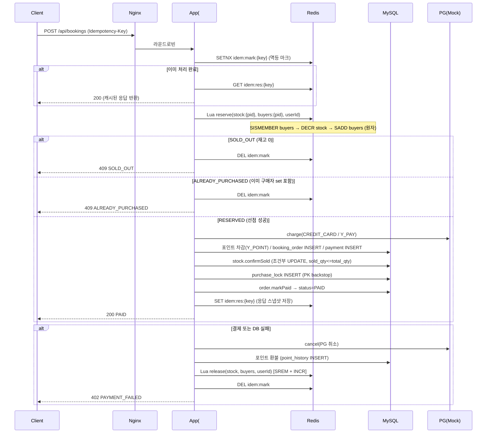
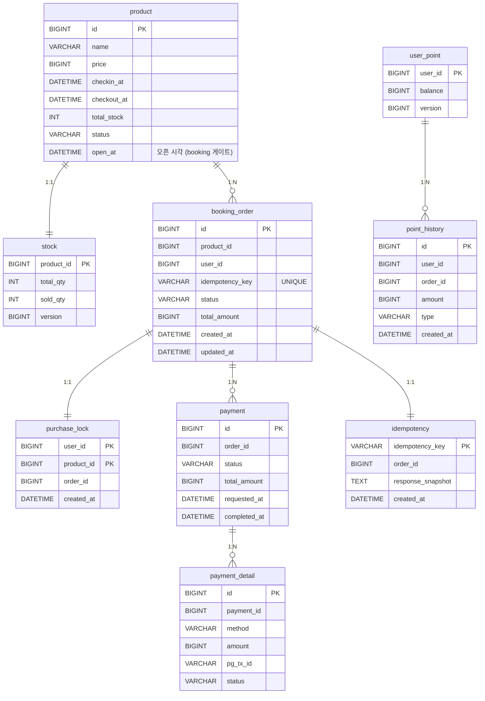

# midnight-deal

한정 수량 심야 특가 예약·결제 플랫폼.  
Redis 원자 Lua 스크립트로 재고 선점(공정 선착순)을 처리하고, Spring Boot 2-인스턴스 + Nginx 로드밸런싱 구성으로 고가용성을 확보한다.

---

## 시스템 아키텍처

```
Client
  │
  ▼
┌─────────────────────┐
│   Nginx 1.27        │  :8080  (라운드로빈)
└────────┬────────────┘
         │
    ┌────┴────┐
    ▼         ▼
┌───────┐  ┌───────┐
│ app1  │  │ app2  │  Spring Boot 3.5 / Java 21
└───┬───┘  └───┬───┘
    │           │
    └─────┬─────┘
          │
    ┌─────┴────────────┐
    │                  │
    ▼                  ▼
┌─────────┐      ┌──────────┐
│ Redis 7 │      │ MySQL 8  │
│ (재고·  │      │ (주문·   │
│  멱등)  │      │  결제)   │
└─────────┘      └──────────┘
                       │
                 ┌─────┴──────┐
                 │ PG Mock    │
                 │(CREDIT_CARD│
                 │ / Y_PAY)   │
                 └────────────┘
```

---

## 실행 방법

### 전체 스택 기동

```bash
docker compose up -d --build
```

기동 후 `http://localhost:8080` 에서 API를 호출할 수 있다.

> Nginx → app1/app2 라운드로빈. MySQL·Redis 헬스체크 통과 후 앱이 시작된다.

### 단위·통합 테스트

```bash
./gradlew test
```

Testcontainers 기반 통합 테스트가 포함되어 있다. (MySQL + Redis 컨테이너 자동 기동)

### 부하 테스트

```bash
k6 run k6/booking-load.js
```

기본값: baseline 50 req/s × 1 min → burst 1000 req/s × 2 min.  
`BASE` 환경변수로 엔드포인트를 변경할 수 있다.

```bash
k6 run -e BASE=http://localhost:8080 k6/booking-load.js
```

> **상품 오픈은 k6가 자동 처리한다.** 상품은 기본적으로 닫힌 상태(`open_at` 미래)라 오픈 전에는
> 모든 booking이 `409 NOT_OPEN`으로 막힌다. `booking-load.js`의 `setup()`이 부하 시작 전에
> `POST /admin/products/1/open`을 호출해 상품을 임의 오픈하므로, `k6 run`만 하면 별도 조치가 필요 없다.
>
> 수동으로 오픈하려면(예: 직접 curl 부하나 Postman 테스트):
>
> ```bash
> curl -X POST http://localhost:8080/admin/products/1/open
> ```

### 부하 테스트 후 상태 초기화 → 재테스트

부하 테스트를 한 번 돌리면 재고(10개)가 소진되고 `booking_order`/`purchase_lock`/`payment` 행과
`buyers`/멱등성 Redis 키가 남는다. 이 상태로 다시 돌리면 곧바로 `SOLD_OUT`/`ALREADY_PURCHASED`만
반환된다. 같은 조건으로 다시 측정하려면 **MySQL·Redis 상태를 초기화**해야 한다.

> 주의: `docker compose up`은 MySQL 볼륨과 Redis 컨테이너 상태를 재사용하므로, 단순 재기동만으로는 초기화되지 않는다.

#### 방법 A — 초기화 스크립트 (앱 재기동만, 빠름 / 권장)

```bash
./scripts/reset.sh
```

수행 내용:
1. **MySQL** — 주문/결제/포인트이력/구매락 삭제, `stock.sold_qty=0`, `user_point.balance=50000` 복원
2. **Redis** — `FLUSHALL` (재고 카운터·구매자 집합·멱등성 키 제거)
3. **앱 재시작** — `StockKeyInitializer`가 DB 기준으로 Redis 재고 키를 `stock:{productId}=10`으로 재적재

완료 후 `redis stock:1 = 10`이 출력되면 곧바로 `k6 run k6/booking-load.js` 재실행 가능.
(`DELETE`라 `booking_order.id` AUTO_INCREMENT는 이어진다 — 측정에는 무관.)

수동으로 동일하게 하려면:

```bash
# 1) MySQL 초기화
docker compose exec -T -e MYSQL_PWD=deal mysql mysql -udeal deal -e "
DELETE FROM payment_detail; DELETE FROM payment; DELETE FROM point_history;
DELETE FROM purchase_lock;  DELETE FROM booking_order;
UPDATE stock SET sold_qty=0, version=0;
UPDATE user_point SET balance=50000, version=0;"
# 2) Redis 초기화
docker compose exec -T redis redis-cli FLUSHALL
# 3) 재고 재적재(앱 재기동)
docker compose restart app1 app2
```

#### 방법 B — 완전 초기화 (볼륨까지 삭제, 가장 확실)

ID까지 시드 상태(`booking_order.id` 재시작)로 완전히 되돌리려면 볼륨을 지우고 새로 띄운다.
Flyway가 `V1__schema.sql`+`V2__seed.sql`을 다시 적용하고, 앱 기동 시 Redis 재고가 재적재된다.

```bash
docker compose down -v
docker compose up -d --build
```

#### 초기화 확인

```bash
docker compose exec -T redis redis-cli GET stock:1      # 10
docker compose exec -T -e MYSQL_PWD=deal mysql mysql -udeal deal -N \
  -e "SELECT sold_qty FROM stock WHERE product_id=1;"   # 0
```

---

## API 목록

### GET /api/checkout — 결제 화면 사전 조회

```
GET /api/checkout?productId=1&userId=100
```

**응답 예시 (200 OK)**

```json
{
  "productName": "Midnight Deal Room",
  "price": 100000,
  "checkinAt": "2026-07-01T15:00:00",
  "checkoutAt": "2026-07-02T11:00:00",
  "availablePoint": 50000,
  "allowedCombinations": [
    "CREDIT_CARD+Y_POINT",
    "Y_PAY+Y_POINT",
    "CREDIT_CARD",
    "Y_PAY",
    "Y_POINT"
  ],
  "alreadyPurchased": false
}
```

---

### POST /api/bookings — 예약·결제

```
POST /api/bookings
Idempotency-Key: {클라이언트가 생성한 UUID}
Content-Type: application/json
```

**요청 예시**

```json
{
  "productId": 1,
  "userId": 100,
  "totalAmount": 100000,
  "payments": [
    { "method": "CREDIT_CARD", "amount": 90000 },
    { "method": "Y_POINT",     "amount": 10000 }
  ]
}
```

| 필드 | 타입 | 설명 |
|------|------|------|
| `productId` | Long | 상품 ID |
| `userId` | Long | 사용자 ID |
| `totalAmount` | long | 총 결제 금액 (payments 합계와 일치해야 함) |
| `payments[].method` | String | `CREDIT_CARD` / `Y_PAY` / `Y_POINT` |
| `payments[].amount` | long | 해당 수단 결제 금액 |

헤더 `Idempotency-Key` 는 필수다. 동일 키로 재요청하면 저장된 응답을 반환한다.

**응답 예시 (200 OK)**

```json
{
  "orderId": 42,
  "status": "PAID",
  "message": "예약 완료"
}
```

**오류 응답**

| HTTP | status | 설명 |
|------|--------|------|
| 409 | NOT_OPEN | 상품이 아직 오픈되지 않음 (오픈 시각 이전 또는 닫힘) |
| 409 | SOLD_OUT | 재고 소진 |
| 409 | ALREADY_PURCHASED | 동일 사용자 중복 구매 시도 |
| 402 | PAYMENT_FAILED | 결제 처리 실패 (보상 완료) |
| 409 | DUPLICATE_REQUEST | 동일 멱등 키 처리 진행 중 |

---

### POST /admin/products/{id}/open — 상품 임의 오픈

상품을 즉시 오픈한다(`open_at`을 현재로 당기고 `status=OPEN`). 오픈 전까지 booking은 `409 NOT_OPEN`으로
막히므로, k6 부하 테스트나 수동 테스트 전에 호출한다. (k6는 `setup()`에서 자동 호출한다.)

```bash
curl -X POST http://localhost:8080/admin/products/1/open
```

**응답 예시 (200 OK)**

```json
{
  "productId": 1,
  "openAt": "2026-06-18T00:00:00",
  "status": "OPEN"
}
```

> DB(`product.open_at`)를 진실의 원천으로 갱신하고, 핫패스 판정용 Redis 캐시(`open:{id}`)를 함께 발행한다.
> 운영/테스트 편의용 엔드포인트이며 현재 인증은 적용되어 있지 않다.

---

## Booking 플로우 시퀀스 다이어그램



---

## ERD (주문·결제 도메인)

전체 DDL: [`src/main/resources/db/migration/V1__schema.sql`](src/main/resources/db/migration/V1__schema.sql)



---

## OpenAPI / Swagger

앱 기동 후 아래 URL에서 대화형 API 문서를 확인할 수 있다.

```
http://localhost:8080/swagger-ui.html
```

---

## 프로젝트 구조 요약

```
midnight-deal/
├── src/main/java/com/midnight/deal/
│   ├── booking/          # BookingController, BookingService, BookingConfirmService, IdempotencyService
│   ├── checkout/         # CheckoutController, CheckoutService
│   ├── product/          # Product, AdminProductController, ProductOpenService (임의 오픈)
│   ├── stock/            # StockReservationService, ProductGate(오픈 게이트), DbStockFallback
│   ├── payment/          # PaymentOrchestrator, PaymentCombinationPolicy, Processor 구현체들
│   └── point/            # PointService, UserPointRepository
├── src/main/resources/
│   ├── db/migration/     # V1__schema.sql, V2__seed.sql, V3__add_open_at.sql (Flyway)
│   └── redis/            # reserve.lua, release.lua
├── k6/                   # booking-load.js (부하 테스트)
├── nginx/nginx.conf
├── docker-compose.yml
└── Dockerfile
```
