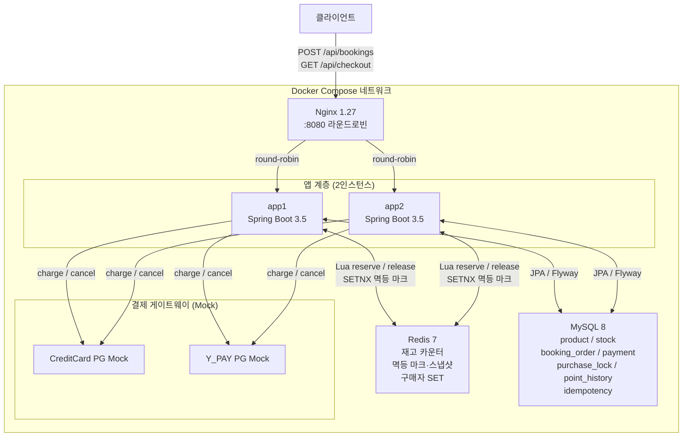
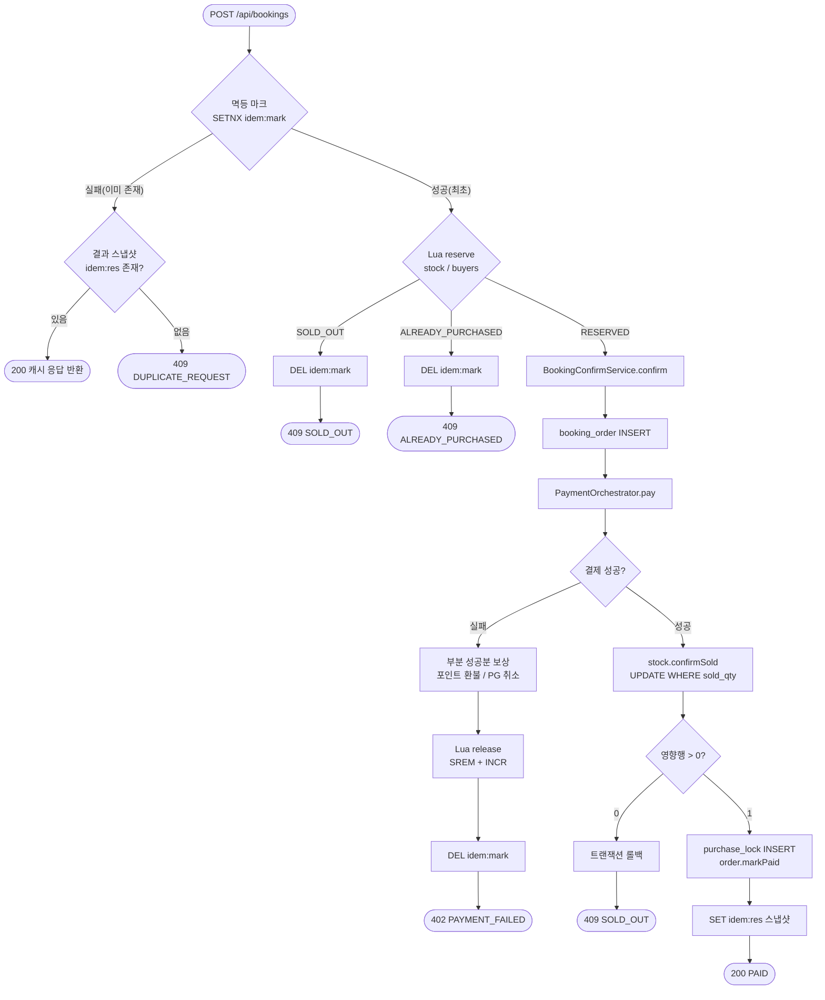
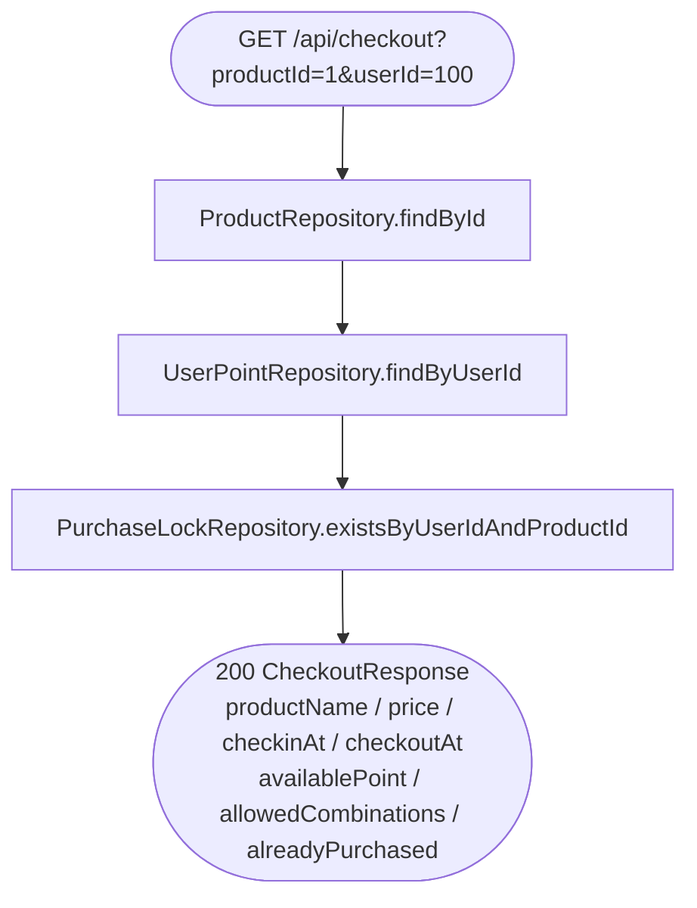

# 시스템 아키텍처

midnight-deal 플랫폼의 컴포넌트 구성, 핵심 흐름, 장애 시나리오를 기술한다.

---

## 1. 컴포넌트 다이어그램



---

## 2. Booking 흐름 (정상 경로)



---

## 3. Checkout 흐름



---

## 4. Redis 장애 → DB Degrade 흐름

```mermaid
flowchart TD
  A[StockReservationService.reserve] --> B{Redis 호출}
  B -- 정상 --> C[Lua reserve.lua 실행]
  C --> D([ReserveResult 반환])
  B -- 예외 / 서킷 OPEN --> E[Resilience4j\n@CircuitBreaker fallbackMethod]
  E --> F[DbStockFallback.reserve]
  F --> G[SELECT * FROM stock\nWHERE product_id=? FOR UPDATE]
  G --> H{lockRepo.exists\nByUserIdAndProductId?}
  H -- true --> I([ALREADY_PURCHASED])
  H -- false --> J{sold_qty >= total_qty?}
  J -- true --> K([SOLD_OUT])
  J -- false --> L([RESERVED — DB 비관락 직렬화])
  L --> M[이후 동일: confirmSold / purchase_lock]
```

서킷브레이커 설정 (`application.yml`):

| 파라미터 | 값 | 의미 |
|----------|----|------|
| `sliding-window-size` | 20 | 최근 20회 호출 기준 |
| `failure-rate-threshold` | 50% | 실패율 50% 초과 시 OPEN |
| `wait-duration-in-open-state` | 5s | OPEN 유지 시간 |
| `permitted-number-of-calls-in-half-open-state` | 3 | HALF-OPEN 탐침 횟수 |

---

## 5. 계층 구조 요약

```
BookingController
  └─ BookingService              ← 멱등·선점·보상 오케스트레이션 (트랜잭션 밖)
       ├─ IdempotencyService     ← Redis SETNX 마크 / 스냅샷
       ├─ StockReservationService← Lua reserve/release + CircuitBreaker
       │    └─ DbStockFallback   ← DB FOR UPDATE fallback
       └─ BookingConfirmService  ← @Transactional: 결제+영속+backstop
            ├─ PaymentOrchestrator ← Strategy dispatch + 보상
            │    ├─ PaymentCombinationPolicy ← 조합 규칙
            │    ├─ CreditCardProcessor / YPayProcessor / YPointProcessor
            │    └─ PointService  ← 포인트 차감·환불
            ├─ StockRepository.confirmSold  ← 조건부 UPDATE backstop
            └─ PurchaseLockRepository       ← PK backstop

CheckoutController
  └─ CheckoutService             ← 상품·포인트·구매이력 조회
```
