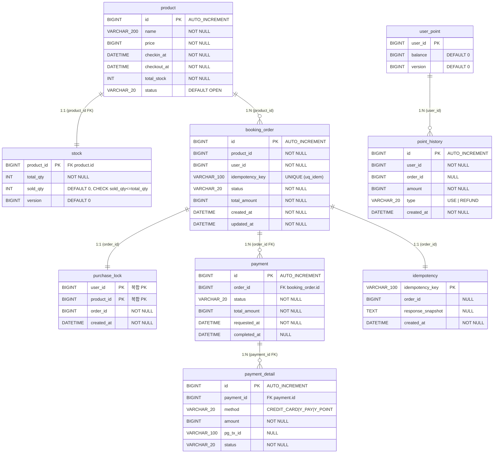

# ERD (Entity Relationship Diagram)

midnight-deal 데이터베이스 스키마.  
전체 DDL: [`src/main/resources/db/migration/V1__schema.sql`](../src/main/resources/db/migration/V1__schema.sql)

---

## Mermaid ER 다이어그램 (9 테이블)



---

## 주요 제약 설명

### 1. `booking_order.idempotency_key` — UNIQUE (uq_idem)

```sql
CONSTRAINT uq_idem UNIQUE (idempotency_key)
```

- Redis `SETNX` 멱등 마크에 더해 **DB 레벨 이중 방어**를 제공한다.
- Redis 장애 후 재시작 시 마크가 사라져도 동일 키의 두 번째 `INSERT`는 이 UNIQUE 제약이 막는다.

### 2. `purchase_lock` — 복합 PK (user_id, product_id)

```sql
PRIMARY KEY (user_id, product_id)
```

- 1인 1구매의 **DB backstop**이다.
- Redis `buyers:{pid}` SET 가드가 1차 방어하고, 이 PK가 2차로 중복 구매 INSERT를 차단한다.
- `BookingConfirmService.confirm()` 트랜잭션 안에서 삽입되므로 결제 실패 시 롤백되어 locks가 남지 않는다.

### 3. `stock.sold_qty` — CHECK 제약 + 조건부 UPDATE

```sql
CONSTRAINT chk_sold CHECK (sold_qty <= total_qty)
```

- `sold_qty`가 `total_qty`를 초과하는 행을 DB 레벨에서 거부한다.
- 애플리케이션은 `StockRepository.confirmSold()`를 통해 다음 조건부 UPDATE를 실행한다:

```sql
UPDATE stock
   SET sold_qty = sold_qty + 1
 WHERE product_id = :productId
   AND sold_qty < total_qty
```

- 영향 행이 0이면 이미 재고가 소진된 것이므로 `BookingConfirmService`가 `SOLD_OUT` 예외를 던지고 트랜잭션이 롤백된다.
- Redis 카운터가 재고를 선점했더라도 DB가 최종 진실의 원천 역할을 한다.

### 4. `stock` — version 컬럼 (낙관락 지원)

```sql
version BIGINT NOT NULL DEFAULT 0
```

- 현재 구현에서는 주로 DB fallback 경로에서 `FOR UPDATE` 비관락을 사용한다.
- `version` 컬럼은 향후 낙관락(`@Version`)으로 전환할 수 있도록 스키마에 포함했다.

### 5. `user_point` — version 컬럼 (낙관락 지원)

```sql
version BIGINT NOT NULL DEFAULT 0
```

- 포인트 차감·환불 동시성 제어를 위한 낙관락 버전 컬럼이다.

### 6. `payment.completed_at` — NULL 허용

```sql
completed_at DATETIME NULL
```

- 결제 요청 시점(`requested_at`)과 완료 시점을 분리한다.
- 결제 실패 또는 진행 중인 경우 `NULL`로 남는다.

### 7. `payment_detail.pg_tx_id` — NULL 허용

```sql
pg_tx_id VARCHAR(100) NULL
```

- PG 트랜잭션 ID는 PG 호출 성공 시에만 채워진다.
- `Y_POINT`(내부 포인트) 결제는 PG 호출이 없으므로 `NULL`이다.

---

## 테이블별 역할 요약

| 테이블 | 역할 |
|--------|------|
| `product` | 상품 기본 정보(이름, 가격, 입퇴실, 재고, 상태) |
| `stock` | 재고 수량 추적. DB backstop(조건부 UPDATE + CHECK 제약) |
| `user_point` | 사용자 포인트 잔액. 낙관락(version) |
| `booking_order` | 주문 엔티티. 멱등 키 UNIQUE 보장 |
| `purchase_lock` | 1인 1구매 DB backstop. 복합 PK |
| `payment` | 결제 헤더(총액, 상태, 요청/완료 시각) |
| `payment_detail` | 결제 수단별 라인 명세(method, amount, pg_tx_id) |
| `point_history` | 포인트 차감·환불 이력 감사 로그 |
| `idempotency` | 멱등 처리 결과 스냅샷 영속화 |
