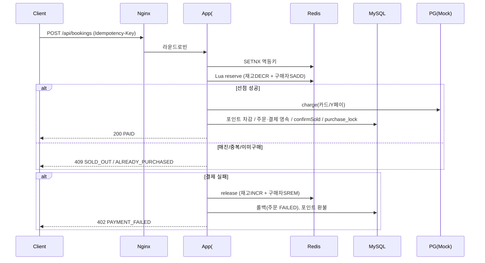

# 선착순 예약/결제 플랫폼 구현 Plan

> **For agentic workers:** REQUIRED SUB-SKILL: Use superpowers:subagent-driven-development (recommended) or superpowers:executing-plans to implement this plan task-by-task. Steps use checkbox (`- [ ]`) syntax for tracking.

**Goal:** 00시 오픈 초특가 숙소(10개 한정) 선착순 예약·결제 시스템을, 앱 2대 분산 환경에서 초과판매 0·1인 1구매·멱등성·결제확장성·장애대응을 보장하도록 구현한다.

**Architecture:** 무상태 앱 2대 + Nginx LB. 재고/구매자/멱등성의 권위 저장소는 Redis(Lua 원자 연산), MySQL은 영속·정합성 backstop. 결제는 `PaymentGateway` 인터페이스 + Mock, Strategy 패턴 Processor로 확장. Redis 장애 시 DB락 경로로 degrade.

**Tech Stack:** Java 21(LTS), Spring Boot 3.5.x, Spring Data JPA(Hibernate), MySQL 8.4, Redis 7(Lettuce), Flyway, Resilience4j, Lombok, Gradle(Kotlin DSL), Docker Compose, Nginx, k6, Testcontainers + Awaitility + JUnit5.

## Global Constraints

- 언어/런타임: **Java 21**. 빌드: **Gradle Kotlin DSL** (`build.gradle.kts`).
- 프레임워크: **Spring Boot 3.5.x** 이상.
- RDB: **MySQL 8.x**. Cache/원자: **Redis 7**.
- 패키지 루트: `com.midnight.deal`.
- 앱 **2대 이상** 분산 기동, 앱은 **무상태**. 코드 수정 없이 `docker-compose up`으로 전체 기동 가능해야 한다.
- 회사명·"서비스·조직" 등 식별 문구를 코드·문서·저장소명에 **포함 금지**.
- 재고 권위 카운터 = Redis. 정합성 최후 방어선 = MySQL 조건부 UPDATE + UNIQUE/PK 제약.
- 모든 외부 의존(PG)은 인터페이스로 추상화, 실제 연동은 Mock.
- 신용카드 + Y페이 **혼용 불가**. 복합결제는 `(신용카드+포인트)` 또는 `(Y페이+포인트)`만 허용.
- 테스트는 Testcontainers(MySQL/Redis) 기반. 동시성은 Awaitility로 단언.
- 커밋: 각 태스크 종료 시 커밋. 메시지에 회사·서비스 식별 문구 금지.

---

## File Structure (전체 맵)

```
build.gradle.kts / settings.gradle.kts / gradlew(+wrapper)
Dockerfile
docker-compose.yml
nginx/nginx.conf
k6/booking-load.js
src/main/resources/
  application.yml
  db/migration/V1__schema.sql
  db/migration/V2__seed.sql
  redis/reserve.lua
  redis/release.lua
src/main/java/com/midnight/deal/
  DealApplication.java
  common/
    ApiExceptionHandler.java
    BusinessException.java / ErrorCode.java
  config/
    RedisConfig.java
    Resilience4jConfig.java
  product/
    Product.java / ProductRepository.java
  stock/
    Stock.java / StockRepository.java
    StockReservationService.java          (Redis Lua 원자 가드 + DB락 fallback)
    ReserveResult.java
  point/
    UserPoint.java / UserPointRepository.java
    PointHistory.java / PointHistoryRepository.java
    PointService.java
  payment/
    PaymentMethod.java
    PaymentProcessor.java / PaymentCommand.java / PaymentResult.java
    CreditCardProcessor.java / YPayProcessor.java / YPointProcessor.java
    PaymentCombinationPolicy.java
    PaymentOrchestrator.java / PaymentLine.java / PaymentContext.java / PaymentOutcome.java
    Payment.java / PaymentDetail.java / PaymentRepository.java
    gateway/ PaymentGateway.java / MockPaymentGateway.java / PgResult.java
  booking/
    BookingOrder.java / BookingOrderRepository.java / OrderStatus.java
    PurchaseLock.java / PurchaseLockRepository.java
    IdempotencyService.java
    BookingService.java / BookingController.java
    dto/ BookingRequest.java / BookingResponse.java
  checkout/
    CheckoutController.java / CheckoutService.java / CheckoutResponse.java
src/test/java/com/midnight/deal/  (태스크별 테스트)
```

각 파일 = 단일 책임. 재고/결제/주문 도메인별로 묶는다(기술 레이어가 아니라 책임 기준).

---

## Task 1: Gradle 골격 + 부팅 스모크 테스트

**Files:**
- Create: `settings.gradle.kts`, `build.gradle.kts`, `gradle/wrapper/gradle-wrapper.properties`, `gradlew`, `gradlew.bat`, `gradle/wrapper/gradle-wrapper.jar`
- Create: `src/main/java/com/midnight/deal/DealApplication.java`
- Create: `src/main/resources/application.yml`
- Test: `src/test/java/com/midnight/deal/DealApplicationTests.java`

**Interfaces:**
- Produces: `DealApplication` (Spring Boot 진입점), Gradle 빌드 가능 상태.

- [ ] **Step 1: Gradle wrapper 생성**

Run: `gradle wrapper --gradle-version 8.10` (로컬 gradle 없으면 8.10 배포 wrapper 파일을 받아 배치)
Expected: `gradlew`, `gradle/wrapper/*` 생성.

- [ ] **Step 2: `settings.gradle.kts` 작성**

```kotlin
rootProject.name = "midnight-deal"
```

- [ ] **Step 3: `build.gradle.kts` 작성**

```kotlin
plugins {
    java
    id("org.springframework.boot") version "3.5.0"
    id("io.spring.dependency-management") version "1.1.6"
}

group = "com.midnight"
version = "0.0.1"

java {
    toolchain { languageVersion = JavaLanguageVersion.of(21) }
}

repositories { mavenCentral() }

dependencies {
    implementation("org.springframework.boot:spring-boot-starter-web")
    implementation("org.springframework.boot:spring-boot-starter-data-jpa")
    implementation("org.springframework.boot:spring-boot-starter-data-redis")
    implementation("org.springframework.boot:spring-boot-starter-validation")
    implementation("org.springframework.boot:spring-boot-starter-actuator")
    implementation("io.github.resilience4j:resilience4j-spring-boot3:2.2.0")
    implementation("org.flywaydb:flyway-core")
    implementation("org.flywaydb:flyway-mysql")
    implementation("org.springdoc:springdoc-openapi-starter-webmvc-ui:2.6.0")
    runtimeOnly("com.mysql:mysql-connector-j")
    compileOnly("org.projectlombok:lombok")
    annotationProcessor("org.projectlombok:lombok")

    testImplementation("org.springframework.boot:spring-boot-starter-test")
    testImplementation("org.testcontainers:junit-jupiter:1.20.4")
    testImplementation("org.testcontainers:mysql:1.20.4")
    testImplementation("com.redis:testcontainers-redis:2.2.2")
    testImplementation("org.awaitility:awaitility:4.2.2")
    testCompileOnly("org.projectlombok:lombok")
    testAnnotationProcessor("org.projectlombok:lombok")
}

tasks.withType<Test> { useJUnitPlatform() }
```

- [ ] **Step 4: `DealApplication.java` 작성**

```java
package com.midnight.deal;

import org.springframework.boot.SpringApplication;
import org.springframework.boot.autoconfigure.SpringBootApplication;

@SpringBootApplication
public class DealApplication {
    public static void main(String[] args) {
        SpringApplication.run(DealApplication.class, args);
    }
}
```

- [ ] **Step 5: `application.yml` 작성 (로컬/도커 프로파일)**

```yaml
spring:
  application.name: midnight-deal
  datasource:
    url: jdbc:mysql://${DB_HOST:localhost}:${DB_PORT:3306}/deal?useSSL=false&serverTimezone=UTC&allowPublicKeyRetrieval=true
    username: ${DB_USER:deal}
    password: ${DB_PASSWORD:deal}
  jpa:
    hibernate.ddl-auto: validate
    open-in-view: false
    properties.hibernate.format_sql: true
  flyway:
    enabled: true
    locations: classpath:db/migration
  data:
    redis:
      host: ${REDIS_HOST:localhost}
      port: ${REDIS_PORT:6379}

server:
  port: ${SERVER_PORT:8080}

management:
  endpoints.web.exposure.include: health,info
  endpoint.health.show-details: always

app:
  instance-id: ${INSTANCE_ID:local}
  stock:
    fallback-enabled: true   # Redis 장애 시 DB락 경로 degrade
```

- [ ] **Step 6: 스모크 테스트 작성 (실패 확인용)**

```java
package com.midnight.deal;

import org.junit.jupiter.api.Test;

class DealApplicationTests {
    @Test
    void mainClassExists() {
        // 컨텍스트 로딩 테스트는 Task 3(스키마) 이후 활성화. 여기선 클래스 존재만 확인.
        org.junit.jupiter.api.Assertions.assertNotNull(DealApplication.class);
    }
}
```

- [ ] **Step 7: 빌드/테스트 실행**

Run: `./gradlew test`
Expected: PASS (컴파일·테스트 성공).

- [ ] **Step 8: 커밋**

```bash
git add build.gradle.kts settings.gradle.kts gradle gradlew gradlew.bat src
git commit -m "build: Gradle + Spring Boot 3.5 골격 부팅"
```

---

## Task 2: Docker Compose 분산 인프라 (앱 2대 + Nginx + MySQL + Redis)

**Files:**
- Create: `Dockerfile`, `docker-compose.yml`, `nginx/nginx.conf`

**Interfaces:**
- Produces: `docker-compose up`으로 `app1`,`app2`,`nginx`(8080),`mysql`(3306),`redis`(6379) 기동. LB는 `http://localhost:8080`.

- [ ] **Step 1: `Dockerfile` 작성 (멀티스테이지)**

```dockerfile
FROM eclipse-temurin:21-jdk AS build
WORKDIR /app
COPY . .
RUN ./gradlew clean bootJar -x test --no-daemon

FROM eclipse-temurin:21-jre
WORKDIR /app
COPY --from=build /app/build/libs/*.jar app.jar
ENTRYPOINT ["java","-jar","/app/app.jar"]
```

- [ ] **Step 2: `nginx/nginx.conf` 작성 (라운드로빈 LB)**

```nginx
events {}
http {
    upstream app_servers {
        server app1:8080;
        server app2:8080;
    }
    server {
        listen 8080;
        location / {
            proxy_pass http://app_servers;
            proxy_set_header Host $host;
            proxy_set_header X-Real-IP $remote_addr;
        }
    }
}
```

- [ ] **Step 3: `docker-compose.yml` 작성**

```yaml
services:
  mysql:
    image: mysql:8.4
    environment:
      MYSQL_ROOT_PASSWORD: root
      MYSQL_DATABASE: deal
      MYSQL_USER: deal
      MYSQL_PASSWORD: deal
    ports: ["3306:3306"]
    healthcheck:
      test: ["CMD", "mysqladmin", "ping", "-h", "localhost", "-uroot", "-proot"]
      interval: 5s
      timeout: 3s
      retries: 20

  redis:
    image: redis:7
    ports: ["6379:6379"]
    healthcheck:
      test: ["CMD", "redis-cli", "ping"]
      interval: 5s
      timeout: 3s
      retries: 20

  app1:
    build: .
    environment:
      DB_HOST: mysql
      REDIS_HOST: redis
      INSTANCE_ID: app1
    depends_on:
      mysql: { condition: service_healthy }
      redis: { condition: service_healthy }

  app2:
    build: .
    environment:
      DB_HOST: mysql
      REDIS_HOST: redis
      INSTANCE_ID: app2
    depends_on:
      mysql: { condition: service_healthy }
      redis: { condition: service_healthy }

  nginx:
    image: nginx:1.27
    volumes:
      - ./nginx/nginx.conf:/etc/nginx/nginx.conf:ro
    ports: ["8080:8080"]
    depends_on: [app1, app2]
```

- [ ] **Step 4: 기동 검증 (수동)**

Run: `docker compose up -d --build && sleep 40 && curl -s localhost:8080/actuator/health`
Expected: `{"status":"UP",...}` (라운드로빈으로 app1/app2 응답). 검증 후 `docker compose down`.

> 참고: 이 단계는 Task 3 스키마가 있어야 앱이 정상 부팅한다. Task 3 완료 후 재검증한다.

- [ ] **Step 5: 커밋**

```bash
git add Dockerfile docker-compose.yml nginx
git commit -m "infra: docker-compose 앱2+Nginx+MySQL+Redis 분산 기동"
```

---

## Task 3: Flyway 스키마 DDL + 시드 + 컨텍스트 로딩 테스트

**Files:**
- Create: `src/main/resources/db/migration/V1__schema.sql`, `V2__seed.sql`
- Test: `src/test/java/com/midnight/deal/support/AbstractIntegrationTest.java` (Testcontainers 베이스)
- Modify: `src/test/java/com/midnight/deal/DealApplicationTests.java`

**Interfaces:**
- Produces: 전 테이블 스키마, 시드(상품 1·재고 10·유저 포인트), `AbstractIntegrationTest`(MySQL+Redis 컨테이너 + Flyway 적용 컨텍스트).

- [ ] **Step 1: `V1__schema.sql` 작성**

```sql
CREATE TABLE product (
  id BIGINT PRIMARY KEY AUTO_INCREMENT,
  name VARCHAR(200) NOT NULL,
  price BIGINT NOT NULL,
  checkin_at DATETIME NOT NULL,
  checkout_at DATETIME NOT NULL,
  total_stock INT NOT NULL,
  status VARCHAR(20) NOT NULL DEFAULT 'OPEN'
);

CREATE TABLE stock (
  product_id BIGINT PRIMARY KEY,
  total_qty INT NOT NULL,
  sold_qty INT NOT NULL DEFAULT 0,
  version BIGINT NOT NULL DEFAULT 0,
  CONSTRAINT fk_stock_product FOREIGN KEY (product_id) REFERENCES product(id),
  CONSTRAINT chk_sold CHECK (sold_qty <= total_qty)
);

CREATE TABLE user_point (
  user_id BIGINT PRIMARY KEY,
  balance BIGINT NOT NULL DEFAULT 0,
  version BIGINT NOT NULL DEFAULT 0
);

CREATE TABLE booking_order (
  id BIGINT PRIMARY KEY AUTO_INCREMENT,
  product_id BIGINT NOT NULL,
  user_id BIGINT NOT NULL,
  idempotency_key VARCHAR(100) NOT NULL,
  status VARCHAR(20) NOT NULL,
  total_amount BIGINT NOT NULL,
  created_at DATETIME NOT NULL,
  updated_at DATETIME NOT NULL,
  CONSTRAINT uq_idem UNIQUE (idempotency_key)
);

CREATE TABLE purchase_lock (
  user_id BIGINT NOT NULL,
  product_id BIGINT NOT NULL,
  order_id BIGINT NOT NULL,
  created_at DATETIME NOT NULL,
  PRIMARY KEY (user_id, product_id)
);

CREATE TABLE payment (
  id BIGINT PRIMARY KEY AUTO_INCREMENT,
  order_id BIGINT NOT NULL,
  status VARCHAR(20) NOT NULL,
  total_amount BIGINT NOT NULL,
  requested_at DATETIME NOT NULL,
  completed_at DATETIME NULL,
  CONSTRAINT fk_pay_order FOREIGN KEY (order_id) REFERENCES booking_order(id)
);

CREATE TABLE payment_detail (
  id BIGINT PRIMARY KEY AUTO_INCREMENT,
  payment_id BIGINT NOT NULL,
  method VARCHAR(20) NOT NULL,
  amount BIGINT NOT NULL,
  pg_tx_id VARCHAR(100) NULL,
  status VARCHAR(20) NOT NULL,
  CONSTRAINT fk_detail_pay FOREIGN KEY (payment_id) REFERENCES payment(id)
);

CREATE TABLE point_history (
  id BIGINT PRIMARY KEY AUTO_INCREMENT,
  user_id BIGINT NOT NULL,
  order_id BIGINT NULL,
  amount BIGINT NOT NULL,
  type VARCHAR(20) NOT NULL,
  created_at DATETIME NOT NULL
);

CREATE TABLE idempotency (
  idempotency_key VARCHAR(100) PRIMARY KEY,
  order_id BIGINT NULL,
  response_snapshot TEXT NULL,
  created_at DATETIME NOT NULL
);
```

- [ ] **Step 2: `V2__seed.sql` 작성 (상품 1·재고 10·유저 포인트)**

```sql
INSERT INTO product (id, name, price, checkin_at, checkout_at, total_stock, status)
VALUES (1, 'Midnight Deal Room', 100000, '2026-07-01 15:00:00', '2026-07-02 11:00:00', 10, 'OPEN');

INSERT INTO stock (product_id, total_qty, sold_qty, version) VALUES (1, 10, 0, 0);

-- 테스트용 사용자 포인트 (user 1~2000)
INSERT INTO user_point (user_id, balance, version)
SELECT seq, 50000, 0 FROM (
  WITH RECURSIVE s(seq) AS (SELECT 1 UNION ALL SELECT seq+1 FROM s WHERE seq < 2000)
  SELECT seq FROM s
) t;
```

- [ ] **Step 3: `AbstractIntegrationTest` 작성 (Testcontainers 베이스)**

```java
package com.midnight.deal.support;

import com.redis.testcontainers.RedisContainer;
import org.springframework.boot.test.context.SpringBootTest;
import org.springframework.test.context.DynamicPropertyRegistry;
import org.springframework.test.context.DynamicPropertySource;
import org.testcontainers.containers.MySQLContainer;
import org.testcontainers.junit.jupiter.Container;
import org.testcontainers.junit.jupiter.Testcontainers;
import org.testcontainers.utility.DockerImageName;

@SpringBootTest
@Testcontainers
public abstract class AbstractIntegrationTest {

    @Container
    static MySQLContainer<?> mysql = new MySQLContainer<>("mysql:8.4").withDatabaseName("deal");

    @Container
    static RedisContainer redis = new RedisContainer(DockerImageName.parse("redis:7"));

    @DynamicPropertySource
    static void props(DynamicPropertyRegistry r) {
        r.add("spring.datasource.url", mysql::getJdbcUrl);
        r.add("spring.datasource.username", mysql::getUsername);
        r.add("spring.datasource.password", mysql::getPassword);
        r.add("spring.data.redis.host", redis::getHost);
        r.add("spring.data.redis.port", () -> redis.getMappedPort(6379));
    }
}
```

- [ ] **Step 4: 컨텍스트 로딩 테스트로 교체**

```java
package com.midnight.deal;

import com.midnight.deal.support.AbstractIntegrationTest;
import org.junit.jupiter.api.Test;

class DealApplicationTests extends AbstractIntegrationTest {
    @Test
    void contextLoads() {}
}
```

- [ ] **Step 5: 테스트 실행 (스키마+컨테이너 검증)**

Run: `./gradlew test --tests com.midnight.deal.DealApplicationTests`
Expected: PASS (Flyway가 V1/V2 적용, 컨텍스트 로딩 성공).

- [ ] **Step 6: 커밋**

```bash
git add src/main/resources/db src/test
git commit -m "feat: Flyway 스키마/시드 + Testcontainers 통합 베이스"
```

---

## Task 4: 도메인 엔티티 + 리포지토리

**Files:**
- Create: `product/Product.java`,`product/ProductRepository.java`, `stock/Stock.java`,`stock/StockRepository.java`, `point/UserPoint.java`,`point/UserPointRepository.java`,`point/PointHistory.java`,`point/PointHistoryRepository.java`, `booking/BookingOrder.java`,`booking/OrderStatus.java`,`booking/BookingOrderRepository.java`,`booking/PurchaseLock.java`,`booking/PurchaseLockRepository.java`, `payment/Payment.java`,`payment/PaymentDetail.java`,`payment/PaymentRepository.java`,`payment/PaymentMethod.java`
- Test: `src/test/java/com/midnight/deal/domain/RepositoryTest.java`

**Interfaces:**
- Produces: JPA 엔티티/리포지토리 전체. 주요 시그니처:
  - `ProductRepository.findById(Long)`
  - `StockRepository.confirmSold(Long productId) -> int` (조건부 UPDATE 영향 행)
  - `StockRepository.restore(Long productId) -> int`
  - `UserPointRepository.findByUserId(Long)`
  - `BookingOrderRepository.findByIdempotencyKey(String)`
  - `PurchaseLockRepository.existsByUserIdAndProductId(Long,Long)`
  - enum `OrderStatus{PENDING,PAID,FAILED,CANCELED}`, `PaymentMethod{CREDIT_CARD,Y_PAY,Y_POINT}`

- [ ] **Step 1: 실패 테스트 작성 (리포지토리 기본 동작 + 조건부 UPDATE)**

```java
package com.midnight.deal.domain;

import com.midnight.deal.stock.StockRepository;
import com.midnight.deal.product.ProductRepository;
import com.midnight.deal.support.AbstractIntegrationTest;
import org.junit.jupiter.api.Test;
import org.springframework.beans.factory.annotation.Autowired;

import static org.assertj.core.api.Assertions.assertThat;

class RepositoryTest extends AbstractIntegrationTest {
    @Autowired ProductRepository productRepo;
    @Autowired StockRepository stockRepo;

    @Test
    void seedLoaded() {
        assertThat(productRepo.findById(1L)).isPresent();
    }

    @Test
    void confirmSold_increments_until_total() {
        int affected = stockRepo.confirmSold(1L);
        assertThat(affected).isEqualTo(1); // sold_qty 0 -> 1
    }
}
```

- [ ] **Step 2: 테스트 실행 → 컴파일 실패 확인**

Run: `./gradlew test --tests com.midnight.deal.domain.RepositoryTest`
Expected: FAIL (ProductRepository/StockRepository 미정의).

- [ ] **Step 3: enum 작성**

```java
// booking/OrderStatus.java
package com.midnight.deal.booking;
public enum OrderStatus { PENDING, PAID, FAILED, CANCELED }
```
```java
// payment/PaymentMethod.java
package com.midnight.deal.payment;
public enum PaymentMethod { CREDIT_CARD, Y_PAY, Y_POINT }
```

- [ ] **Step 4: Product/Stock 엔티티+리포지토리**

```java
// product/Product.java
package com.midnight.deal.product;

import jakarta.persistence.*;
import lombok.Getter;
import java.time.LocalDateTime;

@Entity @Table(name = "product") @Getter
public class Product {
    @Id private Long id;
    private String name;
    private long price;
    private LocalDateTime checkinAt;
    private LocalDateTime checkoutAt;
    private int totalStock;
    private String status;
}
```
```java
// product/ProductRepository.java
package com.midnight.deal.product;
import org.springframework.data.jpa.repository.JpaRepository;
public interface ProductRepository extends JpaRepository<Product, Long> {}
```
```java
// stock/Stock.java
package com.midnight.deal.stock;

import jakarta.persistence.*;
import lombok.Getter;

@Entity @Table(name = "stock") @Getter
public class Stock {
    @Id @Column(name = "product_id") private Long productId;
    private int totalQty;
    private int soldQty;
    @Version private long version;
}
```
```java
// stock/StockRepository.java
package com.midnight.deal.stock;

import jakarta.persistence.LockModeType;
import org.springframework.data.jpa.repository.JpaRepository;
import org.springframework.data.jpa.repository.Lock;
import org.springframework.data.jpa.repository.Modifying;
import org.springframework.data.jpa.repository.Query;
import org.springframework.data.repository.query.Param;
import java.util.Optional;

public interface StockRepository extends JpaRepository<Stock, Long> {

    @Modifying(clearAutomatically = true)
    @Query("update Stock s set s.soldQty = s.soldQty + 1, s.version = s.version + 1 " +
           "where s.productId = :pid and s.soldQty < s.totalQty")
    int confirmSold(@Param("pid") Long pid);

    @Modifying(clearAutomatically = true)
    @Query("update Stock s set s.soldQty = s.soldQty - 1 where s.productId = :pid and s.soldQty > 0")
    int restore(@Param("pid") Long pid);

    @Lock(LockModeType.PESSIMISTIC_WRITE)
    @Query("select s from Stock s where s.productId = :pid")
    Optional<Stock> findForUpdate(@Param("pid") Long pid);
}
```

- [ ] **Step 5: Point 엔티티+리포지토리**

```java
// point/UserPoint.java
package com.midnight.deal.point;

import jakarta.persistence.*;
import lombok.Getter;

@Entity @Table(name = "user_point") @Getter
public class UserPoint {
    @Id @Column(name = "user_id") private Long userId;
    private long balance;
    @Version private long version;

    public void use(long amount) {
        if (balance < amount) throw new IllegalStateException("INSUFFICIENT_POINT");
        this.balance -= amount;
    }
    public void refund(long amount) { this.balance += amount; }
}
```
```java
// point/UserPointRepository.java
package com.midnight.deal.point;
import org.springframework.data.jpa.repository.JpaRepository;
import java.util.Optional;
public interface UserPointRepository extends JpaRepository<UserPoint, Long> {
    Optional<UserPoint> findByUserId(Long userId);
}
```
```java
// point/PointHistory.java
package com.midnight.deal.point;

import jakarta.persistence.*;
import lombok.Getter; import lombok.NoArgsConstructor;
import java.time.LocalDateTime;

@Entity @Table(name = "point_history") @Getter @NoArgsConstructor
public class PointHistory {
    @Id @GeneratedValue(strategy = GenerationType.IDENTITY) private Long id;
    private Long userId;
    private Long orderId;
    private long amount;
    private String type; // USE / REFUND
    private LocalDateTime createdAt;

    public PointHistory(Long userId, Long orderId, long amount, String type) {
        this.userId = userId; this.orderId = orderId; this.amount = amount;
        this.type = type; this.createdAt = LocalDateTime.now();
    }
}
```
```java
// point/PointHistoryRepository.java
package com.midnight.deal.point;
import org.springframework.data.jpa.repository.JpaRepository;
public interface PointHistoryRepository extends JpaRepository<PointHistory, Long> {}
```

- [ ] **Step 6: Order/PurchaseLock 엔티티+리포지토리**

```java
// booking/BookingOrder.java
package com.midnight.deal.booking;

import jakarta.persistence.*;
import lombok.Getter; import lombok.NoArgsConstructor;
import java.time.LocalDateTime;

@Entity @Table(name = "booking_order") @Getter @NoArgsConstructor
public class BookingOrder {
    @Id @GeneratedValue(strategy = GenerationType.IDENTITY) private Long id;
    private Long productId;
    private Long userId;
    private String idempotencyKey;
    @Enumerated(EnumType.STRING) private OrderStatus status;
    private long totalAmount;
    private LocalDateTime createdAt;
    private LocalDateTime updatedAt;

    public BookingOrder(Long productId, Long userId, String key, long totalAmount) {
        this.productId = productId; this.userId = userId; this.idempotencyKey = key;
        this.totalAmount = totalAmount; this.status = OrderStatus.PENDING;
        this.createdAt = LocalDateTime.now(); this.updatedAt = this.createdAt;
    }
    public void markPaid() { this.status = OrderStatus.PAID; this.updatedAt = LocalDateTime.now(); }
    public void markFailed() { this.status = OrderStatus.FAILED; this.updatedAt = LocalDateTime.now(); }
}
```
```java
// booking/BookingOrderRepository.java
package com.midnight.deal.booking;
import org.springframework.data.jpa.repository.JpaRepository;
import java.util.Optional;
public interface BookingOrderRepository extends JpaRepository<BookingOrder, Long> {
    Optional<BookingOrder> findByIdempotencyKey(String key);
}
```
```java
// booking/PurchaseLock.java
package com.midnight.deal.booking;

import jakarta.persistence.*;
import lombok.Getter; import lombok.NoArgsConstructor;
import java.io.Serializable; import java.time.LocalDateTime; import java.util.Objects;

@Entity @Table(name = "purchase_lock") @Getter @NoArgsConstructor
@IdClass(PurchaseLock.Pk.class)
public class PurchaseLock {
    @Id private Long userId;
    @Id private Long productId;
    private Long orderId;
    private LocalDateTime createdAt;

    public PurchaseLock(Long userId, Long productId, Long orderId) {
        this.userId = userId; this.productId = productId; this.orderId = orderId;
        this.createdAt = LocalDateTime.now();
    }
    public static class Pk implements Serializable {
        private Long userId; private Long productId;
        public Pk() {} public Pk(Long u, Long p){userId=u;productId=p;}
        @Override public boolean equals(Object o){ if(!(o instanceof Pk k))return false;
            return Objects.equals(userId,k.userId)&&Objects.equals(productId,k.productId);}
        @Override public int hashCode(){return Objects.hash(userId,productId);}
    }
}
```
```java
// booking/PurchaseLockRepository.java
package com.midnight.deal.booking;
import org.springframework.data.jpa.repository.JpaRepository;
public interface PurchaseLockRepository extends JpaRepository<PurchaseLock, PurchaseLock.Pk> {
    boolean existsByUserIdAndProductId(Long userId, Long productId);
    void deleteByUserIdAndProductId(Long userId, Long productId);
}
```

- [ ] **Step 7: Payment/PaymentDetail 엔티티+리포지토리**

```java
// payment/Payment.java
package com.midnight.deal.payment;

import jakarta.persistence.*;
import lombok.Getter; import lombok.NoArgsConstructor;
import java.time.LocalDateTime; import java.util.ArrayList; import java.util.List;

@Entity @Table(name = "payment") @Getter @NoArgsConstructor
public class Payment {
    @Id @GeneratedValue(strategy = GenerationType.IDENTITY) private Long id;
    private Long orderId;
    private String status;
    private long totalAmount;
    private LocalDateTime requestedAt;
    private LocalDateTime completedAt;

    @OneToMany(cascade = CascadeType.ALL, orphanRemoval = true)
    @JoinColumn(name = "payment_id")
    private List<PaymentDetail> details = new ArrayList<>();

    public Payment(Long orderId, long totalAmount) {
        this.orderId = orderId; this.totalAmount = totalAmount;
        this.status = "REQUESTED"; this.requestedAt = LocalDateTime.now();
    }
    public void addDetail(PaymentDetail d){ details.add(d); }
    public void complete(){ this.status="COMPLETED"; this.completedAt=LocalDateTime.now(); }
    public void fail(){ this.status="FAILED"; this.completedAt=LocalDateTime.now(); }
}
```
```java
// payment/PaymentDetail.java
package com.midnight.deal.payment;

import jakarta.persistence.*;
import lombok.Getter; import lombok.NoArgsConstructor;

@Entity @Table(name = "payment_detail") @Getter @NoArgsConstructor
public class PaymentDetail {
    @Id @GeneratedValue(strategy = GenerationType.IDENTITY) private Long id;
    @Enumerated(EnumType.STRING) private PaymentMethod method;
    private long amount;
    private String pgTxId;
    private String status;

    public PaymentDetail(PaymentMethod method, long amount, String pgTxId, String status) {
        this.method = method; this.amount = amount; this.pgTxId = pgTxId; this.status = status;
    }
}
```
```java
// payment/PaymentRepository.java
package com.midnight.deal.payment;
import org.springframework.data.jpa.repository.JpaRepository;
public interface PaymentRepository extends JpaRepository<Payment, Long> {}
```

- [ ] **Step 8: 테스트 실행 → 통과**

Run: `./gradlew test --tests com.midnight.deal.domain.RepositoryTest`
Expected: PASS.

- [ ] **Step 9: 커밋**

```bash
git add src/main/java/com/midnight/deal src/test/java/com/midnight/deal/domain
git commit -m "feat: 주문/결제/재고/포인트 도메인 엔티티·리포지토리"
```

---

## Task 5: Checkout API (GET /api/checkout)

**Files:**
- Create: `checkout/CheckoutService.java`, `checkout/CheckoutResponse.java`, `checkout/CheckoutController.java`
- Test: `src/test/java/com/midnight/deal/checkout/CheckoutApiTest.java`

**Interfaces:**
- Consumes: `ProductRepository`, `StockRepository`, `UserPointRepository`, `PurchaseLockRepository`.
- Produces: `GET /api/checkout?productId&userId` → `CheckoutResponse(productName, price, checkinAt, checkoutAt, remainingStockHint, availablePoint, allowedCombinations, alreadyPurchased)`.

- [ ] **Step 1: 실패 테스트 작성**

```java
package com.midnight.deal.checkout;

import com.midnight.deal.support.AbstractIntegrationTest;
import org.junit.jupiter.api.Test;
import org.springframework.beans.factory.annotation.Autowired;
import org.springframework.http.MediaType;
import org.springframework.test.web.servlet.MockMvc;
import org.springframework.boot.test.autoconfigure.web.servlet.AutoConfigureMockMvc;

import static org.springframework.test.web.servlet.request.MockMvcRequestBuilders.get;
import static org.springframework.test.web.servlet.result.MockMvcResultMatchers.*;

@AutoConfigureMockMvc
class CheckoutApiTest extends AbstractIntegrationTest {
    @Autowired MockMvc mvc;

    @Test
    void checkout_returns_product_and_point() throws Exception {
        mvc.perform(get("/api/checkout").param("productId","1").param("userId","1")
                .accept(MediaType.APPLICATION_JSON))
           .andExpect(status().isOk())
           .andExpect(jsonPath("$.productName").value("Midnight Deal Room"))
           .andExpect(jsonPath("$.availablePoint").value(50000))
           .andExpect(jsonPath("$.alreadyPurchased").value(false));
    }
}
```

- [ ] **Step 2: 실행 → 실패 확인**

Run: `./gradlew test --tests com.midnight.deal.checkout.CheckoutApiTest`
Expected: FAIL (404 / 컨트롤러 미정의).

- [ ] **Step 3: `CheckoutResponse` 작성**

```java
package com.midnight.deal.checkout;
import java.time.LocalDateTime; import java.util.List;

public record CheckoutResponse(
    String productName, long price,
    LocalDateTime checkinAt, LocalDateTime checkoutAt,
    long availablePoint, List<String> allowedCombinations, boolean alreadyPurchased
) {}
```

- [ ] **Step 4: `CheckoutService` 작성**

```java
package com.midnight.deal.checkout;

import com.midnight.deal.booking.PurchaseLockRepository;
import com.midnight.deal.point.UserPointRepository;
import com.midnight.deal.product.Product; import com.midnight.deal.product.ProductRepository;
import lombok.RequiredArgsConstructor;
import org.springframework.stereotype.Service;
import java.util.List;

@Service @RequiredArgsConstructor
public class CheckoutService {
    private final ProductRepository productRepo;
    private final UserPointRepository pointRepo;
    private final PurchaseLockRepository lockRepo;

    public CheckoutResponse checkout(Long productId, Long userId) {
        Product p = productRepo.findById(productId)
            .orElseThrow(() -> new IllegalArgumentException("PRODUCT_NOT_FOUND"));
        long point = pointRepo.findByUserId(userId).map(up -> up.getBalance()).orElse(0L);
        boolean purchased = lockRepo.existsByUserIdAndProductId(userId, productId);
        return new CheckoutResponse(p.getName(), p.getPrice(), p.getCheckinAt(), p.getCheckoutAt(),
            point, List.of("CREDIT_CARD+Y_POINT", "Y_PAY+Y_POINT", "CREDIT_CARD", "Y_PAY", "Y_POINT"),
            purchased);
    }
}
```

- [ ] **Step 5: `CheckoutController` 작성**

```java
package com.midnight.deal.checkout;

import lombok.RequiredArgsConstructor;
import org.springframework.web.bind.annotation.*;

@RestController @RequestMapping("/api/checkout") @RequiredArgsConstructor
public class CheckoutController {
    private final CheckoutService service;

    @GetMapping
    public CheckoutResponse checkout(@RequestParam Long productId, @RequestParam Long userId) {
        return service.checkout(productId, userId);
    }
}
```

- [ ] **Step 6: 실행 → 통과**

Run: `./gradlew test --tests com.midnight.deal.checkout.CheckoutApiTest`
Expected: PASS.

- [ ] **Step 7: 커밋**

```bash
git add src/main/java/com/midnight/deal/checkout src/test/java/com/midnight/deal/checkout
git commit -m "feat: GET /api/checkout 상품·포인트·구매여부 조회"
```

---

## Task 6: 재고 선점 + 1인 1구매 (Redis Lua 원자 가드)

**Files:**
- Create: `src/main/resources/redis/reserve.lua`, `src/main/resources/redis/release.lua`
- Create: `config/RedisConfig.java`, `stock/ReserveResult.java`, `stock/StockReservationService.java`
- Modify: `V2__seed.sql` 불필요 (Redis 키는 서비스가 초기화)
- Create: `stock/StockKeyInitializer.java` (앱 기동 시 Redis 재고 키 적재 — 멱등)
- Test: `src/test/java/com/midnight/deal/stock/StockReservationConcurrencyTest.java`

**Interfaces:**
- Produces:
  - enum `ReserveResult { RESERVED, SOLD_OUT, ALREADY_PURCHASED }`
  - `StockReservationService.reserve(long productId, long userId) -> ReserveResult`
  - `StockReservationService.release(long productId, long userId) -> void`
  - `StockReservationService.initStock(long productId, int qty) -> void`

- [ ] **Step 1: Lua 스크립트 작성**

```lua
-- src/main/resources/redis/reserve.lua
-- KEYS[1]=stock:{pid}  KEYS[2]=buyers:{pid}  ARGV[1]=userId
-- return 1=RESERVED, 0=SOLD_OUT, -1=ALREADY_PURCHASED
if redis.call('SISMEMBER', KEYS[2], ARGV[1]) == 1 then return -1 end
local n = redis.call('GET', KEYS[1])
if not n or tonumber(n) <= 0 then return 0 end
redis.call('DECR', KEYS[1])
redis.call('SADD', KEYS[2], ARGV[1])
return 1
```
```lua
-- src/main/resources/redis/release.lua
-- KEYS[1]=stock:{pid}  KEYS[2]=buyers:{pid}  ARGV[1]=userId
-- 보상: 구매자였으면 SREM + INCR. return 1=released, 0=noop
if redis.call('SISMEMBER', KEYS[2], ARGV[1]) == 1 then
  redis.call('SREM', KEYS[2], ARGV[1])
  redis.call('INCR', KEYS[1])
  return 1
end
return 0
```

- [ ] **Step 2: `RedisConfig` 작성 (Lua 스크립트 빈 + RedisTemplate)**

```java
package com.midnight.deal.config;

import org.springframework.context.annotation.Bean;
import org.springframework.context.annotation.Configuration;
import org.springframework.core.io.ClassPathResource;
import org.springframework.data.redis.connection.RedisConnectionFactory;
import org.springframework.data.redis.core.StringRedisTemplate;
import org.springframework.data.redis.core.script.DefaultRedisScript;
import org.springframework.data.redis.core.script.RedisScript;
import org.springframework.scripting.support.ResourceScriptSource;

@Configuration
public class RedisConfig {
    @Bean
    public StringRedisTemplate stringRedisTemplate(RedisConnectionFactory cf) {
        return new StringRedisTemplate(cf);
    }
    @Bean
    public RedisScript<Long> reserveScript() {
        DefaultRedisScript<Long> s = new DefaultRedisScript<>();
        s.setScriptSource(new ResourceScriptSource(new ClassPathResource("redis/reserve.lua")));
        s.setResultType(Long.class);
        return s;
    }
    @Bean
    public RedisScript<Long> releaseScript() {
        DefaultRedisScript<Long> s = new DefaultRedisScript<>();
        s.setScriptSource(new ResourceScriptSource(new ClassPathResource("redis/release.lua")));
        s.setResultType(Long.class);
        return s;
    }
}
```

- [ ] **Step 3: `ReserveResult` 작성**

```java
package com.midnight.deal.stock;
public enum ReserveResult { RESERVED, SOLD_OUT, ALREADY_PURCHASED }
```

- [ ] **Step 4: `StockReservationService` 작성 (Redis 경로)**

```java
package com.midnight.deal.stock;

import lombok.RequiredArgsConstructor;
import org.springframework.data.redis.core.StringRedisTemplate;
import org.springframework.data.redis.core.script.RedisScript;
import org.springframework.stereotype.Service;
import java.util.List;

@Service @RequiredArgsConstructor
public class StockReservationService {
    private final StringRedisTemplate redis;
    private final RedisScript<Long> reserveScript;
    private final RedisScript<Long> releaseScript;

    private String stockKey(long pid){ return "stock:" + pid; }
    private String buyersKey(long pid){ return "buyers:" + pid; }

    public void initStock(long productId, int qty) {
        redis.opsForValue().set(stockKey(productId), String.valueOf(qty));
        redis.delete(buyersKey(productId));
    }

    public ReserveResult reserve(long productId, long userId) {
        Long r = redis.execute(reserveScript,
            List.of(stockKey(productId), buyersKey(productId)), String.valueOf(userId));
        long code = r == null ? 0 : r;
        if (code == 1) return ReserveResult.RESERVED;
        if (code == -1) return ReserveResult.ALREADY_PURCHASED;
        return ReserveResult.SOLD_OUT;
    }

    public void release(long productId, long userId) {
        redis.execute(releaseScript,
            List.of(stockKey(productId), buyersKey(productId)), String.valueOf(userId));
    }
}
```

- [ ] **Step 5: `StockKeyInitializer` 작성 (기동 시 재고 적재 — DB 기준 멱등)**

```java
package com.midnight.deal.stock;

import com.midnight.deal.product.ProductRepository;
import lombok.RequiredArgsConstructor;
import org.springframework.boot.context.event.ApplicationReadyEvent;
import org.springframework.context.event.EventListener;
import org.springframework.stereotype.Component;

@Component @RequiredArgsConstructor
public class StockKeyInitializer {
    private final ProductRepository productRepo;
    private final StockRepository stockRepo;
    private final StockReservationService reservation;

    // 앱 2대가 동시에 호출해도 set은 동일 값 → 멱등. 운영에선 오픈 직전 1회 적재가 이상적.
    @EventListener(ApplicationReadyEvent.class)
    public void warmUp() {
        productRepo.findAll().forEach(p -> {
            int remaining = stockRepo.findById(p.getId())
                .map(s -> s.getTotalQty() - s.getSoldQty()).orElse(0);
            reservation.initStock(p.getId(), remaining);
        });
    }
}
```

- [ ] **Step 6: 동시성 테스트 작성 (초과판매 0 + 1인 1구매)**

```java
package com.midnight.deal.stock;

import com.midnight.deal.support.AbstractIntegrationTest;
import org.junit.jupiter.api.BeforeEach;
import org.junit.jupiter.api.Test;
import org.springframework.beans.factory.annotation.Autowired;
import java.util.concurrent.*;
import java.util.concurrent.atomic.AtomicInteger;
import static org.assertj.core.api.Assertions.assertThat;

class StockReservationConcurrencyTest extends AbstractIntegrationTest {
    @Autowired StockReservationService service;

    @BeforeEach void init(){ service.initStock(1L, 10); }

    @Test
    void only_10_reserved_among_many_distinct_users() throws Exception {
        int users = 500;
        ExecutorService pool = Executors.newFixedThreadPool(64);
        CountDownLatch ready = new CountDownLatch(users), go = new CountDownLatch(1);
        AtomicInteger reserved = new AtomicInteger();
        for (int u = 1; u <= users; u++) {
            final long uid = u;
            pool.submit(() -> {
                ready.countDown();
                try { go.await(); } catch (InterruptedException ignored) {}
                if (service.reserve(1L, uid) == ReserveResult.RESERVED) reserved.incrementAndGet();
            });
        }
        ready.await(); go.countDown(); pool.shutdown();
        pool.awaitTermination(30, TimeUnit.SECONDS);
        assertThat(reserved.get()).isEqualTo(10); // 초과판매 0, 미달 0
    }

    @Test
    void same_user_reserves_at_most_once() throws Exception {
        int attempts = 50;
        ExecutorService pool = Executors.newFixedThreadPool(16);
        CountDownLatch go = new CountDownLatch(1);
        AtomicInteger reserved = new AtomicInteger();
        for (int i = 0; i < attempts; i++) {
            pool.submit(() -> {
                try { go.await(); } catch (InterruptedException ignored) {}
                if (service.reserve(1L, 7L) == ReserveResult.RESERVED) reserved.incrementAndGet();
            });
        }
        go.countDown(); pool.shutdown(); pool.awaitTermination(30, TimeUnit.SECONDS);
        assertThat(reserved.get()).isEqualTo(1); // 같은 유저는 1회만
    }
}
```

- [ ] **Step 7: 실행 → 통과 확인**

Run: `./gradlew test --tests com.midnight.deal.stock.StockReservationConcurrencyTest`
Expected: PASS (정확히 10 / 같은 유저 1회).

- [ ] **Step 8: 커밋**

```bash
git add src/main/resources/redis src/main/java/com/midnight/deal/config src/main/java/com/midnight/deal/stock src/test/java/com/midnight/deal/stock
git commit -m "feat: Redis Lua 원자 재고선점 + 1인 1구매 가드 (초과판매 0)"
```

---

## Task 7: 결제 모듈 — PG 게이트웨이 인터페이스 + Mock

**Files:**
- Create: `payment/gateway/PaymentGateway.java`,`payment/gateway/PgResult.java`,`payment/gateway/MockPaymentGateway.java`
- Test: `src/test/java/com/midnight/deal/payment/MockPaymentGatewayTest.java`

**Interfaces:**
- Produces:
  - `PgResult(boolean success, String txId, String failureReason)` (정적 팩토리 `ok(txId)`, `fail(reason)`)
  - `PaymentGateway.charge(PaymentMethod method, long userId, long amount) -> PgResult`
  - `PaymentGateway.cancel(String txId) -> void`
  - `MockPaymentGateway`: 금액/시나리오로 성공·한도초과·타임아웃 주입.

- [ ] **Step 1: 실패 테스트 작성**

```java
package com.midnight.deal.payment;

import com.midnight.deal.payment.gateway.MockPaymentGateway;
import com.midnight.deal.payment.gateway.PgResult;
import org.junit.jupiter.api.Test;
import static org.assertj.core.api.Assertions.*;

class MockPaymentGatewayTest {
    MockPaymentGateway gw = new MockPaymentGateway();

    @Test
    void success_returns_tx() {
        PgResult r = gw.charge(PaymentMethod.CREDIT_CARD, 1L, 1000);
        assertThat(r.success()).isTrue();
        assertThat(r.txId()).isNotBlank();
    }

    @Test
    void over_limit_amount_fails() {
        // 9,000,000 초과 금액 = 한도초과 시뮬레이션
        PgResult r = gw.charge(PaymentMethod.CREDIT_CARD, 1L, 9_999_999);
        assertThat(r.success()).isFalse();
        assertThat(r.failureReason()).isEqualTo("LIMIT_EXCEEDED");
    }
}
```

- [ ] **Step 2: 실행 → 실패 확인**

Run: `./gradlew test --tests com.midnight.deal.payment.MockPaymentGatewayTest`
Expected: FAIL (클래스 미정의).

- [ ] **Step 3: `PgResult` 작성**

```java
package com.midnight.deal.payment.gateway;
public record PgResult(boolean success, String txId, String failureReason) {
    public static PgResult ok(String txId){ return new PgResult(true, txId, null); }
    public static PgResult fail(String reason){ return new PgResult(false, null, reason); }
}
```

- [ ] **Step 4: `PaymentGateway` 인터페이스 작성**

```java
package com.midnight.deal.payment.gateway;
import com.midnight.deal.payment.PaymentMethod;
public interface PaymentGateway {
    PgResult charge(PaymentMethod method, long userId, long amount);
    void cancel(String txId);
}
```

- [ ] **Step 5: `MockPaymentGateway` 작성 (시나리오 주입)**

```java
package com.midnight.deal.payment.gateway;

import com.midnight.deal.payment.PaymentMethod;
import org.springframework.stereotype.Component;
import java.util.concurrent.atomic.AtomicLong;

@Component
public class MockPaymentGateway implements PaymentGateway {
    private final AtomicLong seq = new AtomicLong();
    private static final long LIMIT = 9_000_000;

    @Override
    public PgResult charge(PaymentMethod method, long userId, long amount) {
        if (amount > LIMIT) return PgResult.fail("LIMIT_EXCEEDED");
        if (amount <= 0)    return PgResult.fail("INVALID_AMOUNT");
        // 실제 PG 호출 자리 — 인터페이스로만 흐름 유지
        return PgResult.ok(method + "-" + seq.incrementAndGet());
    }
    @Override public void cancel(String txId) { /* PG 취소 호출 자리 (Mock no-op) */ }
}
```

- [ ] **Step 6: 실행 → 통과**

Run: `./gradlew test --tests com.midnight.deal.payment.MockPaymentGatewayTest`
Expected: PASS.

- [ ] **Step 7: 커밋**

```bash
git add src/main/java/com/midnight/deal/payment/gateway src/test/java/com/midnight/deal/payment/MockPaymentGatewayTest.java
git commit -m "feat: PG 게이트웨이 인터페이스 + Mock (한도초과 시뮬레이션)"
```

---

## Task 8: 결제 Processor (Strategy) + 포인트 서비스

**Files:**
- Create: `payment/PaymentCommand.java`,`payment/PaymentResult.java`,`payment/PaymentProcessor.java`
- Create: `payment/CreditCardProcessor.java`,`payment/YPayProcessor.java`,`payment/YPointProcessor.java`
- Create: `point/PointService.java`
- Test: `src/test/java/com/midnight/deal/payment/ProcessorTest.java`, `src/test/java/com/midnight/deal/point/PointServiceTest.java`

**Interfaces:**
- Consumes: `PaymentGateway`, `UserPointRepository`, `PointHistoryRepository`.
- Produces:
  - `PaymentCommand(PaymentMethod method, long userId, long orderId, long amount)`
  - `PaymentResult(boolean success, PaymentMethod method, long amount, String pgTxId, String failureReason)`
  - `PaymentProcessor.supports(PaymentMethod) / process(PaymentCommand) -> PaymentResult / cancel(PaymentResult)`
  - `PointService.use(userId, orderId, amount) / refund(userId, orderId, amount)`

- [ ] **Step 1: PointService 실패 테스트**

```java
package com.midnight.deal.point;

import com.midnight.deal.support.AbstractIntegrationTest;
import org.junit.jupiter.api.Test;
import org.springframework.beans.factory.annotation.Autowired;
import static org.assertj.core.api.Assertions.*;

class PointServiceTest extends AbstractIntegrationTest {
    @Autowired PointService service;
    @Autowired UserPointRepository repo;

    @Test
    void use_then_refund_restores_balance() {
        long before = repo.findByUserId(10L).orElseThrow().getBalance();
        service.use(10L, 1L, 3000);
        assertThat(repo.findByUserId(10L).orElseThrow().getBalance()).isEqualTo(before - 3000);
        service.refund(10L, 1L, 3000);
        assertThat(repo.findByUserId(10L).orElseThrow().getBalance()).isEqualTo(before);
    }

    @Test
    void use_over_balance_throws() {
        assertThatThrownBy(() -> service.use(11L, 1L, 999_999))
            .hasMessageContaining("INSUFFICIENT_POINT");
    }
}
```

- [ ] **Step 2: 실행 → 실패 확인**

Run: `./gradlew test --tests com.midnight.deal.point.PointServiceTest`
Expected: FAIL (PointService 미정의).

- [ ] **Step 3: `PointService` 작성 (낙관락 + 이력)**

```java
package com.midnight.deal.point;

import lombok.RequiredArgsConstructor;
import org.springframework.stereotype.Service;
import org.springframework.transaction.annotation.Transactional;

@Service @RequiredArgsConstructor
public class PointService {
    private final UserPointRepository pointRepo;
    private final PointHistoryRepository historyRepo;

    @Transactional
    public void use(long userId, long orderId, long amount) {
        UserPoint p = pointRepo.findByUserId(userId)
            .orElseThrow(() -> new IllegalStateException("POINT_ACCOUNT_NOT_FOUND"));
        p.use(amount); // 잔액 부족 시 INSUFFICIENT_POINT
        historyRepo.save(new PointHistory(userId, orderId, -amount, "USE"));
    }

    @Transactional
    public void refund(long userId, long orderId, long amount) {
        UserPoint p = pointRepo.findByUserId(userId)
            .orElseThrow(() -> new IllegalStateException("POINT_ACCOUNT_NOT_FOUND"));
        p.refund(amount);
        historyRepo.save(new PointHistory(userId, orderId, amount, "REFUND"));
    }
}
```

- [ ] **Step 4: 실행 → 통과**

Run: `./gradlew test --tests com.midnight.deal.point.PointServiceTest`
Expected: PASS.

- [ ] **Step 5: Processor 계약/구현 작성**

```java
// payment/PaymentCommand.java
package com.midnight.deal.payment;
public record PaymentCommand(PaymentMethod method, long userId, long orderId, long amount) {}
```
```java
// payment/PaymentResult.java
package com.midnight.deal.payment;
public record PaymentResult(boolean success, PaymentMethod method, long amount,
                            String pgTxId, String failureReason) {}
```
```java
// payment/PaymentProcessor.java
package com.midnight.deal.payment;
public interface PaymentProcessor {
    boolean supports(PaymentMethod method);
    PaymentResult process(PaymentCommand cmd);
    void cancel(PaymentResult result);   // 보상
}
```
```java
// payment/CreditCardProcessor.java
package com.midnight.deal.payment;

import com.midnight.deal.payment.gateway.PaymentGateway;
import com.midnight.deal.payment.gateway.PgResult;
import lombok.RequiredArgsConstructor;
import org.springframework.stereotype.Component;

@Component @RequiredArgsConstructor
public class CreditCardProcessor implements PaymentProcessor {
    private final PaymentGateway gateway;
    public boolean supports(PaymentMethod m){ return m == PaymentMethod.CREDIT_CARD; }
    public PaymentResult process(PaymentCommand c){
        PgResult r = gateway.charge(PaymentMethod.CREDIT_CARD, c.userId(), c.amount());
        return new PaymentResult(r.success(), PaymentMethod.CREDIT_CARD, c.amount(), r.txId(), r.failureReason());
    }
    public void cancel(PaymentResult r){ if (r.pgTxId()!=null) gateway.cancel(r.pgTxId()); }
}
```
```java
// payment/YPayProcessor.java
package com.midnight.deal.payment;

import com.midnight.deal.payment.gateway.PaymentGateway;
import com.midnight.deal.payment.gateway.PgResult;
import lombok.RequiredArgsConstructor;
import org.springframework.stereotype.Component;

@Component @RequiredArgsConstructor
public class YPayProcessor implements PaymentProcessor {
    private final PaymentGateway gateway;
    public boolean supports(PaymentMethod m){ return m == PaymentMethod.Y_PAY; }
    public PaymentResult process(PaymentCommand c){
        PgResult r = gateway.charge(PaymentMethod.Y_PAY, c.userId(), c.amount());
        return new PaymentResult(r.success(), PaymentMethod.Y_PAY, c.amount(), r.txId(), r.failureReason());
    }
    public void cancel(PaymentResult r){ if (r.pgTxId()!=null) gateway.cancel(r.pgTxId()); }
}
```
```java
// payment/YPointProcessor.java
package com.midnight.deal.payment;

import com.midnight.deal.point.PointService;
import lombok.RequiredArgsConstructor;
import org.springframework.stereotype.Component;

@Component @RequiredArgsConstructor
public class YPointProcessor implements PaymentProcessor {
    private final PointService pointService;
    public boolean supports(PaymentMethod m){ return m == PaymentMethod.Y_POINT; }
    public PaymentResult process(PaymentCommand c){
        try {
            pointService.use(c.userId(), c.orderId(), c.amount());
            return new PaymentResult(true, PaymentMethod.Y_POINT, c.amount(), "POINT-"+c.orderId(), null);
        } catch (Exception e) {
            return new PaymentResult(false, PaymentMethod.Y_POINT, c.amount(), null, "INSUFFICIENT_POINT");
        }
    }
    public void cancel(PaymentResult r){ /* 포인트 환불은 Orchestrator가 PointService.refund로 보상 */ }
}
```

- [ ] **Step 6: Processor 통합 테스트**

```java
package com.midnight.deal.payment;

import com.midnight.deal.support.AbstractIntegrationTest;
import org.junit.jupiter.api.Test;
import org.springframework.beans.factory.annotation.Autowired;
import java.util.List;
import static org.assertj.core.api.Assertions.*;

class ProcessorTest extends AbstractIntegrationTest {
    @Autowired List<PaymentProcessor> processors;

    @Test
    void each_method_has_one_processor() {
        for (PaymentMethod m : PaymentMethod.values()) {
            long n = processors.stream().filter(p -> p.supports(m)).count();
            assertThat(n).as("method %s", m).isEqualTo(1);
        }
    }
}
```

- [ ] **Step 7: 실행 → 통과**

Run: `./gradlew test --tests com.midnight.deal.payment.ProcessorTest --tests com.midnight.deal.point.PointServiceTest`
Expected: PASS.

- [ ] **Step 8: 커밋**

```bash
git add src/main/java/com/midnight/deal/payment src/main/java/com/midnight/deal/point src/test/java/com/midnight/deal/payment src/test/java/com/midnight/deal/point
git commit -m "feat: Strategy 결제 Processor(카드/Y페이/포인트) + 포인트 서비스"
```

---

## Task 9: 결제 조합 정책 + Orchestrator (복합결제·부분실패 보상)

**Files:**
- Create: `payment/PaymentLine.java`,`payment/PaymentContext.java`,`payment/PaymentOutcome.java`
- Create: `payment/PaymentCombinationPolicy.java`,`payment/PaymentOrchestrator.java`
- Test: `src/test/java/com/midnight/deal/payment/CombinationPolicyTest.java`, `payment/PaymentOrchestratorTest.java`

**Interfaces:**
- Consumes: `List<PaymentProcessor>`, `PointService`, `PaymentRepository`.
- Produces:
  - `PaymentLine(PaymentMethod method, long amount)`
  - `PaymentContext(long orderId, long userId, long totalAmount, List<PaymentLine> lines)`
  - `PaymentOutcome(boolean success, String failureReason, List<PaymentResult> results)`
  - `PaymentCombinationPolicy.validate(List<PaymentLine>)` — 위반 시 `BusinessException`
  - `PaymentOrchestrator.pay(PaymentContext) -> PaymentOutcome`

- [ ] **Step 1: 조합 정책 실패 테스트**

```java
package com.midnight.deal.payment;

import org.junit.jupiter.api.Test;
import java.util.List;
import static org.assertj.core.api.Assertions.*;

class CombinationPolicyTest {
    PaymentCombinationPolicy policy = new PaymentCombinationPolicy();

    @Test void card_plus_point_ok() {
        assertThatCode(() -> policy.validate(List.of(
            new PaymentLine(PaymentMethod.CREDIT_CARD, 9000),
            new PaymentLine(PaymentMethod.Y_POINT, 1000)))).doesNotThrowAnyException();
    }
    @Test void ypay_plus_point_ok() {
        assertThatCode(() -> policy.validate(List.of(
            new PaymentLine(PaymentMethod.Y_PAY, 9000),
            new PaymentLine(PaymentMethod.Y_POINT, 1000)))).doesNotThrowAnyException();
    }
    @Test void card_plus_ypay_rejected() {
        assertThatThrownBy(() -> policy.validate(List.of(
            new PaymentLine(PaymentMethod.CREDIT_CARD, 5000),
            new PaymentLine(PaymentMethod.Y_PAY, 5000))))
            .hasMessageContaining("CARD_YPAY_NOT_ALLOWED");
    }
}
```

- [ ] **Step 2: 실행 → 실패 확인**

Run: `./gradlew test --tests com.midnight.deal.payment.CombinationPolicyTest`
Expected: FAIL.

- [ ] **Step 3: 값 타입 + 정책 작성**

```java
// payment/PaymentLine.java
package com.midnight.deal.payment;
public record PaymentLine(PaymentMethod method, long amount) {}
```
```java
// payment/PaymentContext.java
package com.midnight.deal.payment;
import java.util.List;
public record PaymentContext(long orderId, long userId, long totalAmount, List<PaymentLine> lines) {}
```
```java
// payment/PaymentOutcome.java
package com.midnight.deal.payment;
import java.util.List;
public record PaymentOutcome(boolean success, String failureReason, List<PaymentResult> results) {}
```
```java
// payment/PaymentCombinationPolicy.java
package com.midnight.deal.payment;

import org.springframework.stereotype.Component;
import java.util.List;
import java.util.Set;
import java.util.stream.Collectors;

@Component
public class PaymentCombinationPolicy {
    public void validate(List<PaymentLine> lines) {
        if (lines == null || lines.isEmpty())
            throw new IllegalArgumentException("EMPTY_PAYMENT");
        Set<PaymentMethod> methods = lines.stream().map(PaymentLine::method).collect(Collectors.toSet());
        // 신용카드 + Y페이 혼용 불가
        if (methods.contains(PaymentMethod.CREDIT_CARD) && methods.contains(PaymentMethod.Y_PAY))
            throw new IllegalStateException("CARD_YPAY_NOT_ALLOWED");
        // 동일 수단 중복 라인 금지(합계는 단일 라인으로)
        if (methods.size() != lines.size())
            throw new IllegalStateException("DUPLICATE_METHOD");
    }
}
```

- [ ] **Step 4: 조합 정책 테스트 통과 확인**

Run: `./gradlew test --tests com.midnight.deal.payment.CombinationPolicyTest`
Expected: PASS.

- [ ] **Step 5: Orchestrator 실패 테스트 (부분실패 보상)**

```java
package com.midnight.deal.payment;

import com.midnight.deal.point.UserPointRepository;
import com.midnight.deal.support.AbstractIntegrationTest;
import org.junit.jupiter.api.Test;
import org.springframework.beans.factory.annotation.Autowired;
import java.util.List;
import static org.assertj.core.api.Assertions.*;

class PaymentOrchestratorTest extends AbstractIntegrationTest {
    @Autowired PaymentOrchestrator orchestrator;
    @Autowired UserPointRepository pointRepo;

    @Test
    void composite_success_records_details() {
        PaymentOutcome out = orchestrator.pay(new PaymentContext(0L, 100L, 10000,
            List.of(new PaymentLine(PaymentMethod.CREDIT_CARD, 9000),
                    new PaymentLine(PaymentMethod.Y_POINT, 1000))));
        assertThat(out.success()).isTrue();
    }

    @Test
    void point_success_but_card_over_limit_refunds_point() {
        long before = pointRepo.findByUserId(101L).orElseThrow().getBalance();
        PaymentOutcome out = orchestrator.pay(new PaymentContext(0L, 101L, 9_000_000 + 1000,
            List.of(new PaymentLine(PaymentMethod.Y_POINT, 1000),
                    new PaymentLine(PaymentMethod.CREDIT_CARD, 9_000_000)))); // 카드 한도초과
        assertThat(out.success()).isFalse();
        // 포인트 차감분 환불 확인
        assertThat(pointRepo.findByUserId(101L).orElseThrow().getBalance()).isEqualTo(before);
    }
}
```

- [ ] **Step 6: 실행 → 실패 확인**

Run: `./gradlew test --tests com.midnight.deal.payment.PaymentOrchestratorTest`
Expected: FAIL (Orchestrator 미정의).

- [ ] **Step 7: `PaymentOrchestrator` 작성 (위임 + 부분실패 전체 보상)**

```java
package com.midnight.deal.payment;

import com.midnight.deal.point.PointService;
import lombok.RequiredArgsConstructor;
import org.springframework.stereotype.Service;
import java.util.ArrayList; import java.util.List;

@Service @RequiredArgsConstructor
public class PaymentOrchestrator {
    private final List<PaymentProcessor> processors;
    private final PaymentCombinationPolicy policy;
    private final PointService pointService;

    public PaymentOutcome pay(PaymentContext ctx) {
        policy.validate(ctx.lines());
        long sum = ctx.lines().stream().mapToLong(PaymentLine::amount).sum();
        if (sum != ctx.totalAmount())
            return new PaymentOutcome(false, "AMOUNT_MISMATCH", List.of());

        List<PaymentResult> done = new ArrayList<>();
        for (PaymentLine line : ctx.lines()) {
            PaymentProcessor proc = processors.stream()
                .filter(p -> p.supports(line.method())).findFirst()
                .orElseThrow(() -> new IllegalStateException("NO_PROCESSOR:" + line.method()));
            PaymentResult r = proc.process(new PaymentCommand(line.method(), ctx.userId(), ctx.orderId(), line.amount()));
            if (!r.success()) {
                compensate(ctx, done);                       // 부분 실패 → 성공분 전부 롤백
                return new PaymentOutcome(false, r.failureReason(), done);
            }
            done.add(r);
        }
        return new PaymentOutcome(true, null, done);
    }

    private void compensate(PaymentContext ctx, List<PaymentResult> done) {
        for (PaymentResult r : done) {
            if (r.method() == PaymentMethod.Y_POINT) {
                pointService.refund(ctx.userId(), ctx.orderId(), r.amount());
            } else {
                processors.stream().filter(p -> p.supports(r.method())).findFirst()
                    .ifPresent(p -> p.cancel(r));            // 카드/Y페이 PG 취소
            }
        }
    }
}
```

- [ ] **Step 8: 실행 → 통과**

Run: `./gradlew test --tests com.midnight.deal.payment.PaymentOrchestratorTest`
Expected: PASS.

- [ ] **Step 9: 커밋**

```bash
git add src/main/java/com/midnight/deal/payment src/test/java/com/midnight/deal/payment
git commit -m "feat: 결제 조합 정책 + Orchestrator(복합결제·부분실패 보상)"
```

---

## Task 10: 멱등성 서비스 (Redis SETNX + DB backstop)

**Files:**
- Create: `booking/IdempotencyService.java`
- Create: `common/BusinessException.java`,`common/ErrorCode.java`,`common/ApiExceptionHandler.java`
- Test: `src/test/java/com/midnight/deal/booking/IdempotencyServiceTest.java`

**Interfaces:**
- Consumes: `StringRedisTemplate`, `BookingOrderRepository`.
- Produces:
  - `IdempotencyService.tryBegin(key) -> boolean` (true=최초 진입, false=중복)
  - `IdempotencyService.saveResult(key, json) / findResult(key) -> Optional<String>`
  - `IdempotencyService.clear(key)` (실패 시 재시도 허용)
  - `ErrorCode` enum, `BusinessException(ErrorCode)`

- [ ] **Step 1: 공통 예외 타입 작성**

```java
// common/ErrorCode.java
package com.midnight.deal.common;
public enum ErrorCode {
    SOLD_OUT(409), ALREADY_PURCHASED(409), DUPLICATE_REQUEST(409),
    PAYMENT_FAILED(402), INVALID_COMBINATION(400), AMOUNT_MISMATCH(400),
    PRODUCT_NOT_FOUND(404), SERVICE_UNAVAILABLE(503);
    public final int httpStatus;
    ErrorCode(int s){ this.httpStatus = s; }
}
```
```java
// common/BusinessException.java
package com.midnight.deal.common;
import lombok.Getter;
@Getter
public class BusinessException extends RuntimeException {
    private final ErrorCode code;
    public BusinessException(ErrorCode code){ super(code.name()); this.code = code; }
    public BusinessException(ErrorCode code, String msg){ super(msg); this.code = code; }
}
```
```java
// common/ApiExceptionHandler.java
package com.midnight.deal.common;

import org.springframework.http.ResponseEntity;
import org.springframework.web.bind.annotation.ExceptionHandler;
import org.springframework.web.bind.annotation.RestControllerAdvice;
import java.util.Map;

@RestControllerAdvice
public class ApiExceptionHandler {
    @ExceptionHandler(BusinessException.class)
    public ResponseEntity<?> handle(BusinessException e) {
        return ResponseEntity.status(e.getCode().httpStatus)
            .body(Map.of("code", e.getCode().name(), "message", e.getMessage()));
    }
}
```

- [ ] **Step 2: 멱등성 실패 테스트**

```java
package com.midnight.deal.booking;

import com.midnight.deal.support.AbstractIntegrationTest;
import org.junit.jupiter.api.Test;
import org.springframework.beans.factory.annotation.Autowired;
import static org.assertj.core.api.Assertions.*;

class IdempotencyServiceTest extends AbstractIntegrationTest {
    @Autowired IdempotencyService service;

    @Test
    void first_begin_true_second_false() {
        String key = "idem-" + System.nanoTime();
        assertThat(service.tryBegin(key)).isTrue();
        assertThat(service.tryBegin(key)).isFalse();
    }

    @Test
    void save_and_find_result() {
        String key = "idem-" + System.nanoTime();
        service.tryBegin(key);
        service.saveResult(key, "{\"orderId\":5}");
        assertThat(service.findResult(key)).contains("{\"orderId\":5}");
    }
}
```

- [ ] **Step 3: 실행 → 실패 확인**

Run: `./gradlew test --tests com.midnight.deal.booking.IdempotencyServiceTest`
Expected: FAIL.

- [ ] **Step 4: `IdempotencyService` 작성**

```java
package com.midnight.deal.booking;

import lombok.RequiredArgsConstructor;
import org.springframework.data.redis.core.StringRedisTemplate;
import org.springframework.stereotype.Service;
import java.time.Duration;
import java.util.Optional;

@Service @RequiredArgsConstructor
public class IdempotencyService {
    private final StringRedisTemplate redis;
    private static final Duration TTL = Duration.ofMinutes(10);

    private String mark(String key){ return "idem:mark:" + key; }
    private String result(String key){ return "idem:res:" + key; }

    /** 최초 진입이면 true. 이미 처리중/완료면 false. */
    public boolean tryBegin(String key) {
        Boolean ok = redis.opsForValue().setIfAbsent(mark(key), "1", TTL);
        return Boolean.TRUE.equals(ok);
    }
    public void saveResult(String key, String json) {
        redis.opsForValue().set(result(key), json, TTL);
    }
    public Optional<String> findResult(String key) {
        return Optional.ofNullable(redis.opsForValue().get(result(key)));
    }
    /** 처리 실패 시 마크 해제 → 동일 키 재시도 허용. */
    public void clear(String key) {
        redis.delete(mark(key));
        redis.delete(result(key));
    }
}
```

> 영속 backstop: `booking_order.idempotency_key` UNIQUE 제약(Task 3). Redis 유실 시 DB INSERT가 중복을 거부 → Task 11에서 충돌을 `DUPLICATE_REQUEST`로 변환한다.

- [ ] **Step 5: 실행 → 통과**

Run: `./gradlew test --tests com.midnight.deal.booking.IdempotencyServiceTest`
Expected: PASS.

- [ ] **Step 6: 커밋**

```bash
git add src/main/java/com/midnight/deal/booking/IdempotencyService.java src/main/java/com/midnight/deal/common src/test/java/com/midnight/deal/booking/IdempotencyServiceTest.java
git commit -m "feat: 멱등성 서비스(Redis SETNX) + 공통 예외 처리"
```

---

## Task 11: Booking API 통합 (POST /api/bookings)

**Files:**
- Create: `booking/dto/BookingRequest.java`,`booking/dto/BookingResponse.java`
- Create: `booking/BookingService.java`,`booking/BookingConfirmService.java`,`booking/BookingController.java`
- Test: `src/test/java/com/midnight/deal/booking/BookingApiTest.java`

**Interfaces:**
- Consumes: `IdempotencyService`, `PaymentCombinationPolicy`(간접), `StockReservationService`, `PaymentOrchestrator`, `StockRepository`, `BookingOrderRepository`, `PurchaseLockRepository`, `PaymentRepository`.
- Produces:
  - `POST /api/bookings` (헤더 `Idempotency-Key`) → `BookingResponse(orderId, status, message)`
  - `BookingService.book(String idemKey, BookingRequest) -> BookingResponse` (멱등·선점·Redis 보상 — 트랜잭션 밖)
  - `BookingConfirmService.confirm(String idemKey, BookingRequest) -> BookingResponse` (`@Transactional` 별도 빈 — self-invocation 회피)

- [ ] **Step 1: DTO 작성**

```java
// booking/dto/BookingRequest.java
package com.midnight.deal.booking.dto;
import com.midnight.deal.payment.PaymentMethod;
import jakarta.validation.constraints.*;
import java.util.List;

public record BookingRequest(
    @NotNull Long productId,
    @NotNull Long userId,
    @NotEmpty List<Line> payments,
    @Positive long totalAmount
) {
    public record Line(@NotNull PaymentMethod method, @Positive long amount) {}
}
```
```java
// booking/dto/BookingResponse.java
package com.midnight.deal.booking.dto;
public record BookingResponse(Long orderId, String status, String message) {}
```

- [ ] **Step 2: Booking API 실패 테스트 (해피패스 + 멱등 + 1인1구매 + SOLD_OUT)**

```java
package com.midnight.deal.booking;

import com.fasterxml.jackson.databind.ObjectMapper;
import com.midnight.deal.stock.StockReservationService;
import com.midnight.deal.support.AbstractIntegrationTest;
import org.junit.jupiter.api.BeforeEach;
import org.junit.jupiter.api.Test;
import org.springframework.beans.factory.annotation.Autowired;
import org.springframework.boot.test.autoconfigure.web.servlet.AutoConfigureMockMvc;
import org.springframework.http.MediaType;
import org.springframework.test.web.servlet.MockMvc;

import static org.springframework.test.web.servlet.request.MockMvcRequestBuilders.post;
import static org.springframework.test.web.servlet.result.MockMvcResultMatchers.*;

@AutoConfigureMockMvc
class BookingApiTest extends AbstractIntegrationTest {
    @Autowired MockMvc mvc;
    @Autowired ObjectMapper om;
    @Autowired StockReservationService reservation;

    @BeforeEach void init(){ reservation.initStock(1L, 10); }

    private String body(long userId) throws Exception {
        return om.writeValueAsString(java.util.Map.of(
            "productId", 1, "userId", userId, "totalAmount", 100000,
            "payments", java.util.List.of(
                java.util.Map.of("method","CREDIT_CARD","amount",90000),
                java.util.Map.of("method","Y_POINT","amount",10000))));
    }

    @Test
    void booking_success() throws Exception {
        mvc.perform(post("/api/bookings").header("Idempotency-Key","k-200")
                .contentType(MediaType.APPLICATION_JSON).content(body(200)))
           .andExpect(status().isOk())
           .andExpect(jsonPath("$.status").value("PAID"));
    }

    @Test
    void same_idem_key_returns_same_result() throws Exception {
        mvc.perform(post("/api/bookings").header("Idempotency-Key","k-201")
                .contentType(MediaType.APPLICATION_JSON).content(body(201)))
           .andExpect(status().isOk());
        mvc.perform(post("/api/bookings").header("Idempotency-Key","k-201")
                .contentType(MediaType.APPLICATION_JSON).content(body(201)))
           .andExpect(status().isOk())
           .andExpect(jsonPath("$.status").value("PAID")); // 결제 1회·동일 응답
    }

    @Test
    void same_user_second_order_rejected() throws Exception {
        mvc.perform(post("/api/bookings").header("Idempotency-Key","k-202a")
                .contentType(MediaType.APPLICATION_JSON).content(body(202)))
           .andExpect(status().isOk());
        mvc.perform(post("/api/bookings").header("Idempotency-Key","k-202b") // 다른 키, 같은 유저
                .contentType(MediaType.APPLICATION_JSON).content(body(202)))
           .andExpect(status().isConflict())
           .andExpect(jsonPath("$.code").value("ALREADY_PURCHASED"));
    }
}
```

- [ ] **Step 3: 실행 → 실패 확인**

Run: `./gradlew test --tests com.midnight.deal.booking.BookingApiTest`
Expected: FAIL (컨트롤러/서비스 미정의).

- [ ] **Step 4: `BookingConfirmService` 작성 (`@Transactional` 별도 빈)**

```java
package com.midnight.deal.booking;

import com.midnight.deal.booking.dto.BookingRequest;
import com.midnight.deal.booking.dto.BookingResponse;
import com.midnight.deal.common.BusinessException;
import com.midnight.deal.common.ErrorCode;
import com.midnight.deal.payment.*;
import com.midnight.deal.stock.StockRepository;
import lombok.RequiredArgsConstructor;
import org.springframework.stereotype.Service;
import org.springframework.transaction.annotation.Transactional;
import java.util.List;

@Service @RequiredArgsConstructor
public class BookingConfirmService {
    private final StockRepository stockRepo;
    private final PaymentOrchestrator orchestrator;
    private final BookingOrderRepository orderRepo;
    private final PurchaseLockRepository lockRepo;

    /** 결제+영속+DB backstop을 단일 트랜잭션으로. 실패 시 전체 롤백(주문 INSERT 원복). */
    @Transactional
    public BookingResponse confirm(String idemKey, BookingRequest req) {
        BookingOrder order = orderRepo.save(
            new BookingOrder(req.productId(), req.userId(), idemKey, req.totalAmount()));

        List<PaymentLine> lines = req.payments().stream()
            .map(l -> new PaymentLine(l.method(), l.amount())).toList();
        PaymentOutcome outcome = orchestrator.pay(
            new PaymentContext(order.getId(), req.userId(), req.totalAmount(), lines));

        if (!outcome.success())
            throw new BusinessException(ErrorCode.PAYMENT_FAILED, outcome.failureReason());

        // DB 재고 backstop (조건부 UPDATE) — 영향행 0이면 초과판매 → 롤백
        if (stockRepo.confirmSold(req.productId()) == 0)
            throw new BusinessException(ErrorCode.SOLD_OUT);

        lockRepo.save(new PurchaseLock(req.userId(), req.productId(), order.getId())); // 1인1구매 DB backstop
        order.markPaid();
        return new BookingResponse(order.getId(), "PAID", "예약 완료");
    }
}
```

> 트랜잭션 경계: `confirm`은 **별도 빈**이라 프록시를 거쳐 `@Transactional`이 실제 적용된다(동일 클래스 self-invocation 시 미적용 함정 회피). 실패 시 전체 롤백되어 주문 INSERT·DB backstop이 원복된다. 포인트 차감/환불은 `PaymentOrchestrator`가 별도 트랜잭션으로 단일 책임(부분실패 즉시 환불). Redis 선점 복원은 호출부(`BookingService`)가 담당.

- [ ] **Step 4b: `BookingService` 작성 (멱등 → 선점 → confirm 위임 → Redis 보상)**

```java
package com.midnight.deal.booking;

import com.fasterxml.jackson.databind.ObjectMapper;
import com.midnight.deal.booking.dto.BookingRequest;
import com.midnight.deal.booking.dto.BookingResponse;
import com.midnight.deal.common.BusinessException;
import com.midnight.deal.common.ErrorCode;
import com.midnight.deal.stock.ReserveResult;
import com.midnight.deal.stock.StockReservationService;
import lombok.RequiredArgsConstructor;
import lombok.SneakyThrows;
import org.springframework.stereotype.Service;

@Service @RequiredArgsConstructor
public class BookingService {
    private final IdempotencyService idempotency;
    private final StockReservationService reservation;
    private final BookingConfirmService confirmService;
    private final ObjectMapper om;

    @SneakyThrows
    public BookingResponse book(String idemKey, BookingRequest req) {
        // 1) 멱등성
        if (!idempotency.tryBegin(idemKey)) {
            String prev = idempotency.findResult(idemKey).orElse(null);
            if (prev != null) return om.readValue(prev, BookingResponse.class);
            throw new BusinessException(ErrorCode.DUPLICATE_REQUEST, "IN_PROGRESS");
        }
        try {
            // 2) 재고 선점 + 1인 1구매 (Redis 원자)
            ReserveResult rr = reservation.reserve(req.productId(), req.userId());
            if (rr == ReserveResult.SOLD_OUT) throw new BusinessException(ErrorCode.SOLD_OUT);
            if (rr == ReserveResult.ALREADY_PURCHASED) throw new BusinessException(ErrorCode.ALREADY_PURCHASED);

            // 3) 결제 + 확정 (별도 트랜잭션 빈)
            BookingResponse res = confirmService.confirm(idemKey, req);
            idempotency.saveResult(idemKey, om.writeValueAsString(res));
            return res;
        } catch (BusinessException e) {
            // 선점·결제 실패 → Redis 선점 보상(재고 INCR + 구매자 SREM) + 멱등 마크 해제
            reservation.release(req.productId(), req.userId());
            idempotency.clear(idemKey);
            throw e;
        }
    }
}
```

- [ ] **Step 5: `BookingController` 작성**

```java
package com.midnight.deal.booking;

import com.midnight.deal.booking.dto.BookingRequest;
import com.midnight.deal.booking.dto.BookingResponse;
import jakarta.validation.Valid;
import lombok.RequiredArgsConstructor;
import org.springframework.web.bind.annotation.*;

@RestController @RequestMapping("/api/bookings") @RequiredArgsConstructor
public class BookingController {
    private final BookingService service;

    @PostMapping
    public BookingResponse book(@RequestHeader("Idempotency-Key") String key,
                               @Valid @RequestBody BookingRequest req) {
        return service.book(key, req);
    }
}
```

- [ ] **Step 6: 실행 → 통과**

Run: `./gradlew test --tests com.midnight.deal.booking.BookingApiTest`
Expected: PASS (성공/멱등/1인1구매).

- [ ] **Step 7: 커밋**

```bash
git add src/main/java/com/midnight/deal/booking src/test/java/com/midnight/deal/booking/BookingApiTest.java
git commit -m "feat: POST /api/bookings 멱등→선점→결제→확정/보상 통합"
```

---

## Task 12: Redis 장애 Fallback (DB락 degrade) + 서킷브레이커

**Files:**
- Create: `config/Resilience4jConfig.java` (또는 `application.yml`에 circuitbreaker 설정)
- Modify: `stock/StockReservationService.java` (Redis 실패 시 DB락 경로)
- Create: `stock/DbStockFallback.java`
- Modify: `application.yml` (resilience4j 설정)
- Test: `src/test/java/com/midnight/deal/stock/RedisFallbackTest.java`

**Interfaces:**
- Consumes: `StockRepository.findForUpdate`, `PurchaseLockRepository`.
- Produces: `DbStockFallback.reserve(productId, userId) -> ReserveResult` (비관락 경로). `StockReservationService.reserve`가 Redis 예외 시 fallback 호출.

- [ ] **Step 1: `application.yml`에 resilience4j 추가**

```yaml
resilience4j:
  circuitbreaker:
    instances:
      redisStock:
        sliding-window-size: 20
        failure-rate-threshold: 50
        wait-duration-in-open-state: 5s
        permitted-number-of-calls-in-half-open-state: 3
```

- [ ] **Step 2: DB 비관락 fallback 작성**

```java
package com.midnight.deal.stock;

import com.midnight.deal.booking.PurchaseLockRepository;
import lombok.RequiredArgsConstructor;
import org.springframework.stereotype.Component;
import org.springframework.transaction.annotation.Transactional;

@Component @RequiredArgsConstructor
public class DbStockFallback {
    private final StockRepository stockRepo;
    private final PurchaseLockRepository lockRepo;

    /** Redis 불가 시 DB 비관락 경로. 정합성 유지(throughput↓). */
    @Transactional
    public ReserveResult reserve(long productId, long userId) {
        if (lockRepo.existsByUserIdAndProductId(userId, productId))
            return ReserveResult.ALREADY_PURCHASED;
        Stock s = stockRepo.findForUpdate(productId)
            .orElseThrow(() -> new IllegalStateException("STOCK_NOT_FOUND"));
        if (s.getSoldQty() >= s.getTotalQty()) return ReserveResult.SOLD_OUT;
        // confirmSold는 Task 11에서 결제 성공 후 호출되므로 여기선 가용 여부만 판정.
        // degrade 경로에서는 비관락으로 직렬화되어 동시 초과선점 불가.
        return ReserveResult.RESERVED;
    }
}
```

- [ ] **Step 3: `StockReservationService`에 서킷브레이커 + fallback 연결**

```java
// reserve() 메서드를 아래로 교체
import io.github.resilience4j.circuitbreaker.annotation.CircuitBreaker;
// 필드 추가: private final DbStockFallback dbFallback;

@CircuitBreaker(name = "redisStock", fallbackMethod = "reserveViaDb")
public ReserveResult reserve(long productId, long userId) {
    Long r = redis.execute(reserveScript,
        List.of(stockKey(productId), buyersKey(productId)), String.valueOf(userId));
    long code = r == null ? 0 : r;
    if (code == 1) return ReserveResult.RESERVED;
    if (code == -1) return ReserveResult.ALREADY_PURCHASED;
    return ReserveResult.SOLD_OUT;
}

// 서킷 OPEN 또는 Redis 예외 시 호출 (시그니처 = 원본 + Throwable)
public ReserveResult reserveViaDb(long productId, long userId, Throwable t) {
    return dbFallback.reserve(productId, userId);
}
```

> `release`도 동일하게 `@CircuitBreaker(fallbackMethod=...)`로 DB 경로 보상(생략 시 Redis 복구 후 reconcile). 본 프로젝트 범위에선 reserve 경로 degrade를 핵심으로 시연한다.

- [ ] **Step 4: Fallback 테스트 작성 (Redis 강제 다운)**

```java
package com.midnight.deal.stock;

import com.midnight.deal.support.AbstractIntegrationTest;
import org.junit.jupiter.api.Test;
import org.springframework.beans.factory.annotation.Autowired;
import static org.assertj.core.api.Assertions.*;

class RedisFallbackTest extends AbstractIntegrationTest {
    @Autowired DbStockFallback fallback;

    @Test
    void db_path_reserves_within_stock() {
        // Redis 없이도 DB 비관락 경로가 정합성 유지하며 선점 판정
        ReserveResult r = fallback.reserve(1L, 300L);
        assertThat(r).isIn(ReserveResult.RESERVED, ReserveResult.SOLD_OUT);
    }
}
```

> 실제 "Redis 다운→자동 fallback" 통합 시연은 Task 14 장애 테스트에서 컨테이너 stop으로 검증한다. 여기선 DB 경로 단위 동작을 보장한다.

- [ ] **Step 5: 실행 → 통과**

Run: `./gradlew test --tests com.midnight.deal.stock.RedisFallbackTest`
Expected: PASS.

- [ ] **Step 6: 커밋**

```bash
git add src/main/java/com/midnight/deal/stock src/main/resources/application.yml src/test/java/com/midnight/deal/stock/RedisFallbackTest.java
git commit -m "feat: Redis 장애 시 DB락 degrade + 서킷브레이커"
```

---

## Task 13: 결제 실패 보상 통합 검증 (한도초과 → 재고·포인트·락 복원)

**Files:**
- Test: `src/test/java/com/midnight/deal/booking/BookingFailureCompensationTest.java`
- Modify(필요시): `booking/BookingService.java` 보상 경로 보강

**Interfaces:**
- Consumes: Task 11의 `BookingService`, Task 9의 보상 로직.

- [ ] **Step 1: 보상 통합 테스트 작성**

```java
package com.midnight.deal.booking;

import com.fasterxml.jackson.databind.ObjectMapper;
import com.midnight.deal.point.UserPointRepository;
import com.midnight.deal.stock.ReserveResult;
import com.midnight.deal.stock.StockReservationService;
import com.midnight.deal.support.AbstractIntegrationTest;
import org.junit.jupiter.api.BeforeEach;
import org.junit.jupiter.api.Test;
import org.springframework.beans.factory.annotation.Autowired;
import org.springframework.boot.test.autoconfigure.web.servlet.AutoConfigureMockMvc;
import org.springframework.http.MediaType;
import org.springframework.test.web.servlet.MockMvc;

import static org.assertj.core.api.Assertions.assertThat;
import static org.springframework.test.web.servlet.request.MockMvcRequestBuilders.post;
import static org.springframework.test.web.servlet.result.MockMvcResultMatchers.*;

@AutoConfigureMockMvc
class BookingFailureCompensationTest extends AbstractIntegrationTest {
    @Autowired MockMvc mvc;
    @Autowired ObjectMapper om;
    @Autowired StockReservationService reservation;
    @Autowired UserPointRepository pointRepo;

    @BeforeEach void init(){ reservation.initStock(1L, 10); }

    @Test
    void card_over_limit_restores_stock_point_and_lock() throws Exception {
        long userId = 400L;
        long before = pointRepo.findByUserId(userId).orElseThrow().getBalance();
        String body = om.writeValueAsString(java.util.Map.of(
            "productId",1,"userId",userId,"totalAmount", 9_000_000 + 1000,
            "payments", java.util.List.of(
                java.util.Map.of("method","Y_POINT","amount",1000),
                java.util.Map.of("method","CREDIT_CARD","amount",9_000_000)))); // 카드 한도초과

        mvc.perform(post("/api/bookings").header("Idempotency-Key","fail-400")
                .contentType(MediaType.APPLICATION_JSON).content(body))
           .andExpect(status().isPaymentRequired())
           .andExpect(jsonPath("$.code").value("PAYMENT_FAILED"));

        // 포인트 복원
        assertThat(pointRepo.findByUserId(userId).orElseThrow().getBalance()).isEqualTo(before);
        // 재고 복원 → 같은 유저가 재시도 가능(ALREADY_PURCHASED 아님)
        assertThat(reservation.reserve(1L, userId)).isEqualTo(ReserveResult.RESERVED);
    }
}
```

- [ ] **Step 2: 실행 → 통과 (필요시 BookingService 보상 보강)**

Run: `./gradlew test --tests com.midnight.deal.booking.BookingFailureCompensationTest`
Expected: PASS. 실패 시 `BookingService.book` catch에서 `reservation.release` + `idempotency.clear` 호출 여부, `confirm` 트랜잭션 롤백으로 포인트 원복 여부 점검.

> 검증 포인트: 결제 실패는 `PAYMENT_FAILED`로 `confirm` 내 트랜잭션 롤백 → 주문 INSERT·포인트 차감 원복. 단, 포인트는 `PaymentOrchestrator`가 별도 `@Transactional`로 즉시 차감/환불하므로, 보상 책임이 Orchestrator(환불) + 트랜잭션 경계 양쪽에서 중복되지 않도록 한다. **결정: 포인트 차감/환불은 Orchestrator가 단일 책임**으로 갖고, `confirm`의 롤백은 주문/재고backstop/락에만 관여. (이 경계를 DECISIONS.md에 명시.)

- [ ] **Step 3: 커밋**

```bash
git add src/main/java/com/midnight/deal/booking src/test/java/com/midnight/deal/booking/BookingFailureCompensationTest.java
git commit -m "test: 결제 실패 시 재고·포인트·락 보상 통합 검증"
```

---

## Task 14: 분산 동시성 종단 검증 (HTTP 레벨 초과판매 0)

**Files:**
- Test: `src/test/java/com/midnight/deal/booking/BookingConcurrencyE2ETest.java`

**Interfaces:**
- Consumes: 전체 스택(Booking API).

- [ ] **Step 1: HTTP 동시성 E2E 테스트 작성 (랜덤포트 + 다수 유저)**

```java
package com.midnight.deal.booking;

import com.midnight.deal.stock.StockReservationService;
import com.midnight.deal.support.AbstractIntegrationTest;
import org.junit.jupiter.api.BeforeEach;
import org.junit.jupiter.api.Test;
import org.springframework.beans.factory.annotation.Autowired;
import org.springframework.boot.test.context.SpringBootTest;
import org.springframework.boot.test.web.server.LocalServerPort;
import org.springframework.http.*;
import org.springframework.web.client.RestClient;

import java.util.concurrent.*;
import java.util.concurrent.atomic.AtomicInteger;
import static org.assertj.core.api.Assertions.assertThat;

@SpringBootTest(webEnvironment = SpringBootTest.WebEnvironment.RANDOM_PORT)
class BookingConcurrencyE2ETest extends AbstractIntegrationTest {
    @LocalServerPort int port;
    @Autowired StockReservationService reservation;

    @BeforeEach void init(){ reservation.initStock(1L, 10); }

    @Test
    void only_10_paid_under_concurrent_http() throws Exception {
        RestClient client = RestClient.create();
        int users = 300;
        ExecutorService pool = Executors.newFixedThreadPool(64);
        CountDownLatch go = new CountDownLatch(1);
        AtomicInteger paid = new AtomicInteger();
        for (int u = 500; u < 500 + users; u++) {
            final long uid = u;
            pool.submit(() -> {
                try { go.await(); } catch (InterruptedException ignored) {}
                String body = "{\"productId\":1,\"userId\":"+uid+",\"totalAmount\":100000,"
                    + "\"payments\":[{\"method\":\"CREDIT_CARD\",\"amount\":90000},"
                    + "{\"method\":\"Y_POINT\",\"amount\":10000}]}";
                try {
                    ResponseEntity<String> r = client.post()
                        .uri("http://localhost:"+port+"/api/bookings")
                        .header("Idempotency-Key","e2e-"+uid)
                        .contentType(MediaType.APPLICATION_JSON).body(body)
                        .retrieve().toEntity(String.class);
                    if (r.getStatusCode().is2xxSuccessful()) paid.incrementAndGet();
                } catch (Exception ignored) { /* 409/402 정상 거부 */ }
            });
        }
        go.countDown(); pool.shutdown(); pool.awaitTermination(60, TimeUnit.SECONDS);
        assertThat(paid.get()).isEqualTo(10); // 초과판매 0
    }
}
```

- [ ] **Step 2: 실행 → 통과**

Run: `./gradlew test --tests com.midnight.deal.booking.BookingConcurrencyE2ETest`
Expected: PASS (정확히 10건 PAID).

- [ ] **Step 3: 전체 테스트 회귀**

Run: `./gradlew test`
Expected: 전체 PASS.

- [ ] **Step 4: 커밋**

```bash
git add src/test/java/com/midnight/deal/booking/BookingConcurrencyE2ETest.java
git commit -m "test: HTTP 종단 동시성 — 초과판매 0 단언"
```

---

## Task 15: k6 부하 스크립트 + 실행 가이드

**Files:**
- Create: `k6/booking-load.js`, `k6/README.md`

**Interfaces:**
- 외부 실행(선택). 코드 동작과 무관, 제출용 부하 시나리오.

- [ ] **Step 1: `k6/booking-load.js` 작성 (평시→버스트)**

```javascript
import http from 'k6/http';
import { check } from 'k6';

export const options = {
  scenarios: {
    baseline: { executor: 'constant-arrival-rate', rate: 50, timeUnit: '1s',
      duration: '1m', preAllocatedVUs: 100, maxVUs: 300 },
    burst: { executor: 'ramping-arrival-rate', startRate: 50, timeUnit: '1s',
      startTime: '1m', preAllocatedVUs: 500, maxVUs: 2000,
      stages: [ { target: 1000, duration: '30s' }, { target: 1000, duration: '2m' }, { target: 50, duration: '30s' } ] },
  },
};

const BASE = __ENV.BASE || 'http://localhost:8080';

export default function () {
  const uid = Math.floor(Math.random() * 1000000) + 1000;
  const body = JSON.stringify({ productId: 1, userId: uid, totalAmount: 100000,
    payments: [ { method: 'CREDIT_CARD', amount: 90000 }, { method: 'Y_POINT', amount: 10000 } ] });
  const res = http.post(`${BASE}/api/bookings`, body, {
    headers: { 'Content-Type': 'application/json', 'Idempotency-Key': `load-${uid}-${__ITER}` } });
  check(res, { 'no 5xx': (r) => r.status < 500 }); // 4xx(매진/중복)는 정상
}
```

- [ ] **Step 2: `k6/README.md` 작성 (실행법)**

```markdown
# 부하 테스트 (k6)

평시 50 TPS + 00시 버스트 500~1000 TPS 재현.

## 실행
1. `docker compose up -d --build` (앱 2대 + Nginx + MySQL + Redis)
2. 재고 리셋이 필요하면 앱 재기동(시드 재적재) 또는 Redis 키 재설정
3. `k6 run k6/booking-load.js` (대상 변경: `BASE=http://localhost:8080 k6 run k6/booking-load.js`)

## 판정
- 5xx 비율 0 근접(매진 후 4xx는 정상 fast-fail)
- p95 지연·에러율을 결과로 첨부
```

- [ ] **Step 3: 문법 검증 (선택)**

Run: `k6 inspect k6/booking-load.js` (k6 설치 시)
Expected: 시나리오 파싱 성공. 미설치 시 스킵하고 스크립트 리뷰로 대체.

- [ ] **Step 4: 커밋**

```bash
git add k6
git commit -m "test: k6 부하 시나리오(평시 50→버스트 1000 TPS) + 가이드"
```

---

## Task 16: 문서화 — README.md + DECISIONS.md + OpenAPI

**Files:**
- Create: `README.md`, `DECISIONS.md`
- Create: `docs/architecture.md` (시퀀스 다이어그램·플로우차트), `docs/erd.md`

**Interfaces:** 제출물 문서. 코드와 일치해야 함.

- [ ] **Step 1: `README.md` 작성**

포함 항목(필수):
- 시스템 아키텍처 설명 + 다이어그램(앱2+Nginx+MySQL+Redis+PG Mock)
- 실행 방법: `docker compose up -d --build` → `http://localhost:8080`
- API 목록: `GET /api/checkout`, `POST /api/bookings` (요청/응답 예시, `Idempotency-Key` 헤더)
- **시퀀스 다이어그램**(Booking: 멱등→선점→결제→확정/보상) — Mermaid
- **ERD 또는 DDL**(주문/결제 도메인 중심) — `V1__schema.sql` 링크 + Mermaid ER
- 테스트 실행: `./gradlew test`, 부하: `k6 run k6/booking-load.js`
- OpenAPI: `http://localhost:8080/swagger-ui.html`

Mermaid 시퀀스(본문에 포함):


- [ ] **Step 2: `DECISIONS.md` 작성 (쟁점 8개, 상황/선택지/근거)**

쟁점(spec 9.DECISIONS 목록과 1:1):
1. 공정성·정합성: Redis 원자연산 vs DB락 vs 대기열
2. Redis 장애 Fallback: DB락 degrade vs fail-closed (선택: degrade)
3. 1인 1구매: Redis SET 원자가드 + DB PK backstop + 보상 시 해제
4. 멱등성: Redis SETNX + DB UNIQUE 이중화
5. 결제 확장성: Strategy + 조합정책 외부화(OCP), 포인트 보상 단일 책임 경계
6. 고가용성: 인메모리 카운터 흡수, fast-fail, 서킷브레이커
7. 추가 인프라(k6/Docker Compose/Nginx/Testcontainers) 비용 대비 효과
8. 스택: Java 21 + Spring Boot 3.5 + JPA + MySQL 8 + Lombok + Kotlin Gradle DSL

각 쟁점은 `## 쟁점 N. [제목] / ### 상황 / ### 선택지 / ### 왜 이렇게 판단했는지(트레이드오프)` 형식.

- [ ] **Step 3: `docs/architecture.md`, `docs/erd.md` 작성**

- architecture.md: 컴포넌트 다이어그램 + Booking/Checkout 플로우차트 + 장애 시나리오(Redis 다운→DB degrade) 흐름.
- erd.md: Mermaid ER 다이어그램(8개 테이블 관계) + 각 제약(UNIQUE idem, PK purchase_lock, stock 조건부 UPDATE) 설명.

- [ ] **Step 4: 문서-코드 일치 점검 (수동)**

- API 경로/헤더/응답 필드가 컨트롤러와 일치?
- ERD가 `V1__schema.sql`과 일치?
- 실행 명령이 실제 `docker-compose.yml`과 일치?

- [ ] **Step 5: 커밋**

```bash
git add README.md DECISIONS.md docs/architecture.md docs/erd.md
git commit -m "docs: README(아키텍처/시퀀스/ERD/실행법) + DECISIONS 쟁점 8개"
```

---

## Task 17: 최종 통합 검증 (제출 전 게이트)

**Files:** 없음(검증 전용). 발견 이슈는 해당 태스크로 회귀 수정.

- [ ] **Step 1: 클린 빌드 + 전체 테스트**

Run: `./gradlew clean test`
Expected: 전체 PASS.

- [ ] **Step 2: 분산 기동 종단 확인**

Run:
```bash
docker compose up -d --build
sleep 45
curl -s localhost:8080/actuator/health        # UP
curl -s "localhost:8080/api/checkout?productId=1&userId=1"   # 상품/포인트
curl -s -X POST localhost:8080/api/bookings -H 'Idempotency-Key: smoke-1' \
  -H 'Content-Type: application/json' \
  -d '{"productId":1,"userId":1,"totalAmount":100000,"payments":[{"method":"CREDIT_CARD","amount":90000},{"method":"Y_POINT","amount":10000}]}'
docker compose down
```
Expected: health UP, checkout 200, booking 200 PAID.

- [ ] **Step 3: Redis 장애 degrade 수동 시연**

Run: `docker compose up -d` → `docker compose stop redis` → booking 호출 → DB락 경로로 정합성 유지 응답 확인 → `docker compose start redis`.
Expected: Redis 다운 중에도 초과판매 없이 처리(throughput↓).

- [ ] **Step 4: 제출 체크리스트 점검 (spec §8)**

- [ ] `docker compose up`으로 앱 2대 분산 기동
- [ ] GET Checkout / POST Booking 동작
- [ ] 동시성 초과판매 0 / 미달 0
- [ ] 1인 1구매·멱등성·결제조합·복합·보상 테스트 통과
- [ ] Redis fallback·결제 실패 대응 동작
- [ ] k6 부하 스크립트 + 가이드
- [ ] README/DECISIONS/docs 완비
- [ ] 회사명·서비스 식별 문구 미포함 (`grep -ri` 점검)

- [ ] **Step 5: 식별 문구 정적 점검**

Run: `grep -rIi -e "<회사명>" --exclude-dir=.git --exclude='*.pdf' . | grep -v docs/plan.md | grep -v docs/superpowers || echo "clean"`
Expected: `clean` (제출 산출물에 식별 문구 없음). 내부 계획 문서(docs/plan.md, docs/superpowers)는 제출 전 제외 여부 별도 판단.

- [ ] **Step 6: 최종 커밋/정리**

```bash
git add -A
git commit -m "chore: 제출 전 최종 검증 및 정리"
```

---

## Self-Review (작성자 점검 결과)

**1. Spec 커버리지**
- 재고정합성·공정성 → Task 6, 14 ✓ | Redis 장애 fallback → Task 12 ✓ | 1인 1구매 → Task 6(Redis)+11(DB backstop) ✓
- 멱등성 → Task 10, 11 ✓ | 결제확장성(Strategy/조합/복합) → Task 7,8,9 ✓ | 보상 → Task 9,13 ✓
- 고가용성(서킷/fast-fail) → Task 12 + k6 Task 15 ✓ | Checkout/Booking API → Task 5, 11 ✓
- 분산기동(docker 2대+Nginx) → Task 2 ✓ | ERD/DDL → Task 3 + 문서 Task 16 ✓ | DECISIONS → Task 16 ✓

**2. Placeholder 스캔**
- 모든 코드 단계 완전 코드 포함, "TODO/TBD" 없음. (초안의 Task 12 혼란 노트 제거됨.)

**3. 타입 일관성**
- `ReserveResult{RESERVED,SOLD_OUT,ALREADY_PURCHASED}` (Task 6) → Task 11,12,13 동일 사용 ✓
- `PaymentResult/PaymentLine/PaymentContext/PaymentOutcome` 시그니처 Task 8/9 정의 → Orchestrator·BookingService 일치 ✓
- `StockRepository.confirmSold/restore/findForUpdate` Task 4 정의 → Task 11,12 사용 ✓
- `IdempotencyService.tryBegin/saveResult/findResult/clear` Task 10 정의 → Task 11 사용 ✓
- 포인트 보상 책임 경계(Orchestrator 단일 책임) Task 9·13에서 일관 명시 ✓
- 트랜잭션 경계: `confirm`을 `BookingConfirmService` 별도 빈으로 분리(Task 11 Step 4) → `@Transactional` 프록시 정상 적용, self-invocation 함정 제거 ✓ (롤백 동작은 Task 13 통합 테스트로 검증)
